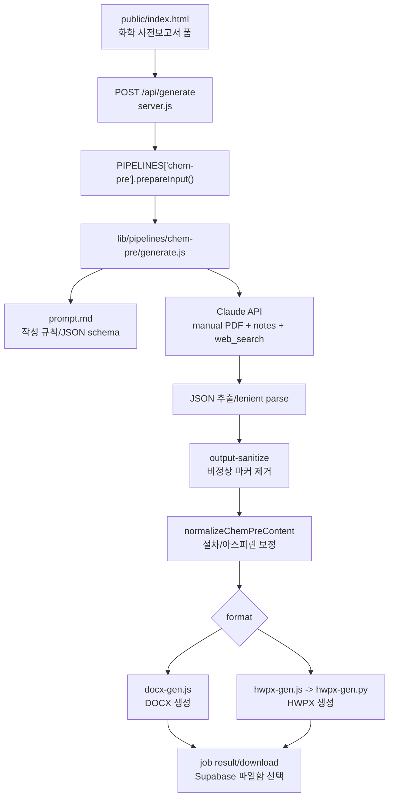

# 화학 사전보고서 생성 파이프라인 상세 문서

이 문서는 Render에서 운영되는 웹 서비스의 **화학 사전보고서(`chem-pre`) 생성 기능**을 유지보수, 검증, 배포하기 위한 상세 기술 문서이다. GitHub에 공개되어도 되도록 API 키, 실제 사용자 계정, 실제 업로드 파일 경로, 개인 토큰은 포함하지 않는다.

## 1. 목적

화학 사전보고서 기능은 사용자가 업로드한 실험 매뉴얼 PDF와 사용자 참고 메모를 바탕으로 Claude API를 호출하고, 실험 전 제출용 사전보고서를 `.docx` 또는 `.hwpx`로 생성한다.

핵심 목표는 다음과 같다.

- (영재학교)과학고 화학실험 사전보고서 양식에 맞는 구조 생성
- 실험 목표, 이론적 배경, 실험 기구 및 시약, 실험 과정을 매뉴얼 기반으로 작성
- 시약 물성, 독성, IUPAC명, 화학식, 참고문헌을 정확히 정리
- 필요한 경우 Claude web search로 PubChem/NIST 등 신뢰 가능한 출처 확인
- 학교 작성요령 풀버전(`default`)과 짧은 학생 스타일(`minimal`)을 구분
- HWPX 출력에서 수식, 화학식, 표, 그림 placeholder, 참고문헌이 깨지지 않게 렌더링

## 2. 전체 구조



## 3. 핵심 파일 지도

| 파일 | 역할 |
|---|---|
| `server.js` | Express 서버, 인증, `/api/generate`, job/SSE, 크레딧, pipeline registry |
| `public/index.html` | 화학 사전보고서 폼 UI, 클라이언트 검증, `FormData`, 진행 로그 표시 |
| `lib/pipelines/chem-pre/generate.js` | Claude 입력 구성, system prompt 조립, web search 설정, JSON 파싱/후처리 |
| `lib/pipelines/chem-pre/prompt.md` | 사전보고서 작성 규칙, 스타일 모드, JSON schema, 금지 패턴 |
| `lib/pipelines/chem-pre/docx-gen.js` | 사전보고서 DOCX 렌더러 |
| `lib/pipelines/chem-pre/hwpx-gen.js` | Node에서 Python HWPX 렌더러를 실행하는 wrapper |
| `lib/pipelines/chem-pre/hwpx-gen.py` | 사전보고서 HWPX 렌더러이자 여러 HWPX 공통 helper |
| `lib/equation/hwpx_equation_tool.py` | HWPX 수식 placeholder를 한컴 수식 객체로 변환 |
| `lib/output-sanitize.js` | Claude 출력에 섞인 HTML/wiki 수식/비정상 마커 정리 |
| `lib/parser.js` | DOCX/HWPX rich text marker 파싱 |
| `lib/document-fonts.js` | 글꼴 선택값 정규화 |
| `lib/pricing.js` | Claude 사용량과 web search 비용 계산 |

## 4. Render 실행과 배포 전제

이 서비스는 Render Web Service에서 Node.js 앱으로 실행된다.

기본 실행:

```bash
npm install
npm start
```

HWPX 출력은 Python 의존성이 필요하다. `package.json`의 `postinstall` 또는 배포 환경에서 `.venv`와 `requirements.txt` 설치가 정상 완료되어야 한다.

필수 환경변수:

| 변수 | 설명 |
|---|---|
| `ANTHROPIC_API_KEY` | Claude API 호출용 키 |
| `SESSION_SECRET` | Express session 서명용 secret |

운영 환경에서 함께 쓰는 변수:

| 변수 | 설명 |
|---|---|
| `SUPABASE_URL` | 사용자/파일함/크레딧 DB용 Supabase URL |
| `SUPABASE_SERVICE_KEY` | Supabase service role key |
| `MAX_TOKENS` | Claude 출력 token 상한, 기본 `32000` |
| `PYTHON_BIN` | HWPX generator용 Python 경로 override |
| `REPORT_STORAGE_BUCKET` | Supabase report bucket |
| `REPORT_RETENTION_HOURS` | 파일함 보관 시간 |
| `RESEND_API_KEY` | 건의사항 이메일 전송용 |
| `FEEDBACK_EMAIL_FROM` 또는 `RESEND_FROM` | 건의사항 발신자 |
| `FEEDBACK_EMAIL_TO` | 건의사항 수신자 |

주의: 실제 key 값은 `.env`, Render dashboard, Supabase dashboard에만 있어야 하며 GitHub 문서나 코드 diff에 넣지 않는다.

## 5. 사용자 입력 폼

웹 UI는 `public/index.html`의 기본 사전보고서 폼에서 관리된다.

서버로 전송되는 필드:

| field | type | 필수 여부 | 설명 |
|---|---|---|---|
| `type` | text | 필수 | `chem-pre` |
| `manual` | file | 필수 | 실험 매뉴얼 PDF |
| `date` | text | 필수 UI | 실험 예정일 |
| `studentId` | text | 선택 | 학번. 계정 프로필 fallback 가능 |
| `studentName` | text | 선택 | 사전보고서 표지/헤더용 이름 |
| `temperature` | text | 선택 | 실험 온도. 사전보고서는 보통 비어 있음 |
| `pressure` | text | 선택 | 기압. 사전보고서는 보통 비어 있음 |
| `model` | text | 선택 | 서버 whitelist: `claude-opus-4-8`(기본)·`claude-sonnet-4-6`·GPT(`gpt-5.5`/`gpt-5.4`/`gpt-5.4-mini`) |
| `format` | text | 선택 | `docx` 또는 `hwpx` |
| `style` | text | 선택 | `default` 또는 `minimal` |
| `fontFace` | text | 선택 | 출력 글꼴 |
| `userNotes` | text | 선택 | AI 참고 메모 / 학생 의견 |
| `copyrightAccepted` | text/bool | 필수 | 저작권 확인 |
| `academicIntegrityAccepted` | text/bool | 필수 | 학교/교사 기준 확인 |

`manual`은 서버에서 mimetype이 `application/pdf`인지 확인한다. 현재 사전보고서는 PDF 매뉴얼만 입력으로 받는다.

## 6. 서버 route 흐름

엔드포인트는 `server.js`의 `POST /api/generate`이다.

처리 순서:

1. `requireAuth`로 로그인 확인
2. `upload.any()`로 multer memory upload 처리
3. `req.body.type`이 없으면 기존 동작 보존을 위해 `chem-pre`로 간주
4. 저작권/학업윤리 동의 확인
5. 업로드 파일명을 `normalizeUploadFilename()`으로 mojibake 복구
6. `filesByField`로 fieldname별 파일 그룹화
7. `PIPELINES["chem-pre"].prepareInput(filesByField, req.body)` 호출
8. 사용자 세션/Supabase에서 학번 보정
9. 일반 사용자 rate limit 확인
10. 일반 사용자 크레딧 잔액 확인
11. 출력 형식(`docx`/`hwpx`)과 모델 whitelist 확인
12. 같은 사용자의 기존 실행 중 job 자동 abort
13. 새 job 생성 후 `runGeneration()` 비동기 실행
14. 클라이언트에는 `{ jobId }` 반환
15. 클라이언트는 `/api/jobs/:id/events` SSE로 진행 로그 수신

## 7. chem-pre pipeline registry

`server.js`의 `PIPELINES["chem-pre"]`가 화학 사전보고서 전용 설정이다.

주요 설정:

- `label`: `화학 사전보고서`
- `filenamePrefix`: `사전`
- `filenameSourceField`: `manual`
- `creditField`: `pre`
- `prepareInput()`: 입력 파일 검증 및 `generateReportContent()` 인자 구성
- `generateContent`: `lib/pipelines/chem-pre/generate.js`
- `generateDocx`: `lib/pipelines/chem-pre/docx-gen.js`
- `generateHwpx`: `lib/pipelines/chem-pre/hwpx-gen.js`

`prepareInput()` 검증:

- `manual`이 없으면 reject
- `manual.mimetype !== "application/pdf"`이면 reject
- `style`은 `minimal`일 때만 minimal, 그 외는 default
- `fontFace`는 `normalizeFontFace()`로 정규화
- `userNotes`는 `collectUserNotes()`→`normalizeUserNotes()`로 줄바꿈 정리 후 최대 `MAX_USER_NOTES_CHARS`자(기본 12000). `.md`/`.txt` 메모 파일(`userNotesFile`/`notesFile`, 최대 256KB)도 합쳐진다.

## 8. Job과 진행 로그

`runGeneration()`은 모든 파이프라인 공통 작업 실행기이다.

핵심 동작:

- `JOB_TIMEOUT_MS` 기준 timeout
- `AbortController`로 사용자 중단/자동 중단 처리
- `pushProgress()`로 SSE progress log 기록
- Claude content 생성
- `content.__allowHighlights`, `content.__fontFace`, `content.__studentInfo` metadata 부착
- `student_id`, `student_name`, `temperature`, `pressure`, `report_number`를 content에 주입
- HWPX/DOCX 빌드
- 다운로드용 `job.result`, `job.filename`, `job.mimeType` 설정
- Supabase가 켜져 있으면 파일함에 24시간 저장
- 사용량/비용 기록과 크레딧 차감

진행 로그 예:

```text
🚀 작업 시작 (화학 사전보고서, timeout: 8분)
🤖 모델: claude-opus-4-8 | 스타일: default
PDF 수신 (512KB), 사용자 메모 포함 — Claude Opus에게 전송
✍️ 보고서 작성 시작
🔍 시약 데이터 웹 검색 중... (1번째)
보고서 작성 중...
✓ Claude 응답 완료 ... — JSON 파싱 중
💰 텍스트 비용: ...
📋 콘텐츠 구조: 이론 N개, 시약 N개, 과정 N개
🖼️ 그림 후보: N개
📄 .hwpx 파일 빌드 중...
✓ .hwpx 빌드 완료
🎉 전체 완료!
```

## 9. Claude 입력 구성

파일: `lib/pipelines/chem-pre/generate.js`

`generateReportContent()`의 입력:

```js
{
  pdfBuffer,
  date,
  userNotes,
  onProgress,
  signal,
  model,
  style,
  outputFormat,
  allowHighlights
}
```

Claude user message는 다음 block들로 구성된다.

1. 매뉴얼 PDF document block
2. 사용자 참고 메모 text block, 있을 때만
3. 최종 지시 text block

PDF block:

```js
{
  type: "document",
  source: {
    type: "base64",
    media_type: "application/pdf",
    data: pdfBuffer.toString("base64")
  }
}
```

마지막 text block에는 다음이 들어간다.

- 첨부된 실험 매뉴얼 PDF를 바탕으로 사전보고서 JSON 생성
- 실험 예정일
- JSON schema와 marker 규칙 준수
- 시약 물성 확신이 없으면 web search 사용
- 최종 출력은 단 하나의 JSON code block

## 10. 사용자 메모 처리

`buildUserNotesBlock(userNotes)`는 사용자가 입력한 메모를 별도 block으로 만든다.

메모의 역할:

- 학생이 강조하고 싶은 실험 준비 맥락
- 교사가 강조한 안전/주의점
- 사전보고서에서 특히 자세히 설명하고 싶은 이론 또는 과정
- 매뉴얼에는 간단히 있지만 보고서에서 보완하고 싶은 부분

제한:

- 메모는 system prompt를 대체하지 않는다.
- 매뉴얼과 충돌하면 매뉴얼이 우선이다.
- 메모를 그대로 붙여넣지 않고 보고서 문체에 녹인다.
- 같은 메모를 여러 절에서 반복하지 않는다.
- 메모에 없는 구체적인 수치, 추가 절차, 교사 발언, 관찰 사실은 만들지 않는다.
- `"꼭"`, `"반드시"` 같은 표현은 사용자의 희망으로만 해석하고 보고서 전체를 그 내용 중심으로 재구성하지 않는다.

## 11. System prompt 구성

`buildSystemPrompt(style, outputFormat, { allowHighlights })`는 다음을 합친다.

1. 역할 설명
2. `prompt.md` 전체 내용
3. 스타일 모드 지시
4. 출력 형식 지시
5. 화학식/수식 marker 규칙
6. JSON schema
7. 분량 가이드
8. 데이터 정확성 가이드
9. 아스피린 합성 정확성 guard
10. 참고문헌 규칙
11. 그림 처리 규칙

`loadSkillForFormat(outputFormat)`:

- HWPX이면 `prompt.md`를 그대로 사용
- DOCX이면 HWPX 전용 수식 marker 예외 문구를 제거해 DOCX prompt가 한 dialect만 따르게 함

`applyHighlightPolicy(text, allowHighlights)`:

- 관리자이면 `**내용**` 하이라이트 marker 허용
- 일반 사용자이면 하이라이트 marker 사용 금지 문구로 치환

## 12. 스타일 모드

### 12.1 default

`default`는 학교 작성요령 풀버전이다.

특징:

- 표지/헤더 포함
- 번호 체계: `1.` → `가.` → `(1)` → `①` 또는 `-`
- 이론 섹션이 전체의 50~60%
- 시약 요약 표 포함
- 특수 기구/복잡한 장치가 있으면 그림 placeholder 사용
- 분량 제한 없음

적합한 경우:

- 정식 사전보고서 제출 전 초안
- 매뉴얼 이론 키워드가 많고 자세한 설명이 필요한 실험
- 시약 물성이 중요한 실험

### 12.2 minimal

`minimal`은 잘 쓴 학생 보고서 스타일의 짧은 모드이다.

특징:

- 표지/목차 없음
- 헤더는 제목 + 학번/이름/날짜 중심
- 3~5페이지 정도를 목표로 자연스럽게 작성
- `가.`, `나.` 헤더 금지
- 핵심 이론 4~6개를 짧게 정리
- `chemicals_summary_table`은 빈 배열
- `figures_needed`는 빈 배열
- `references`는 문자열 배열만 사용
- 한국어 용어 뒤 영어 병기 금지

적합한 경우:

- 사용자가 너무 긴 보고서를 원하지 않을 때
- 선배/학생 작성 스타일에 맞추고 싶을 때
- 그림 placeholder가 필요 없는 단순 실험

## 13. 출력 JSON schema

Claude 출력은 반드시 하나의 JSON code block이어야 한다.

핵심 schema:

```json
{
  "title_kr": "한글 실험 제목",
  "title_en": "English experiment title",
  "purpose": ["실험 목표"],
  "theory": [
    {
      "topic": "이론 주제명",
      "items": [
        "설명 단락",
        { "figure": 1 }
      ]
    }
  ],
  "apparatus": [
    {
      "name": "기구명",
      "name_en": "English name",
      "description": "용도 + 원리/주의사항"
    }
  ],
  "chemicals": [
    {
      "name": "시약명",
      "iupac": "IUPAC명",
      "formula": "H_{2}O",
      "molar_mass": "18.02 g/mol",
      "mp_bp": "0°C / 100°C",
      "density": "1.00 g/mL",
      "properties": "주요 특성",
      "toxicity": "취급 주의사항",
      "source_url": "https://example.invalid/source"
    }
  ],
  "chemicals_summary_table": [
    {
      "name": "시약명",
      "formula": "화학식",
      "molar_mass": "몰질량",
      "mp_bp": "녹는점/끓는점",
      "properties": "주요 특성"
    }
  ],
  "procedure": [
    {
      "title": "실험 A",
      "steps": [
        { "text": "절차 설명", "notes": ["주의사항"] }
      ]
    }
  ],
  "data_table": [
    { "item": "상수", "value": "값" }
  ],
  "figures_needed": [
    {
      "number": 1,
      "caption": "그림 캡션",
      "description": "필요한 그림 설명",
      "search_query": "english image search keywords"
    }
  ],
  "references": [
    { "label": "출처명", "url": "https://example.invalid/source" }
  ]
}
```

렌더러가 자동으로 섹션 번호를 붙이므로 JSON 문자열 안에 `1.`, `가.`, `(1)` 같은 번호를 직접 반복 삽입하지 않는 것이 좋다.

## 14. 화학식과 수식 marker

공통 인라인 marker:

| marker | 의미 | 예 |
|---|---|---|
| `_{내용}` | 아래첨자 | `H_{2}O`, `CO_{2}` |
| `^{내용}` | 위첨자 | `Ca^{2+}`, `10^{-3}` |
| `*내용*` | 이탤릭 | `*PV* = *nRT*` |
| `**내용**` | 핵심 하이라이트 | 관리자에게만 허용 |
| 유니코드 | 그리스 문자 | `α`, `Δ`, `π`, `ρ` |

DOCX:

- `{{EQ:...}}`, `{{EQN:...}}` 같은 이중 중괄호 marker를 쓰면 안 된다.
- 반응식은 일반 텍스트와 인라인 marker로 표현한다.

HWPX:

- 복잡한 식, 분수, 독립 반응식은 `{{EQ:...}}` 또는 `{{EQN:...}}` 사용
- 이 marker는 최종 HWPX에서 한컴 수식 객체로 변환된다.
- `{{MATH:...}}`, `{{FORMULA:...}}`, `[[수식]]`는 금지

한컴 수식 script 예:

```text
{{EQ:2H_{2} + O_{2} -> 2H_{2}O}}
{{EQ:{mRT} over {PV}}}
{{EQ:A BUILDREL -> {H_{2}SO_{4}} B}}
```

## 15. Web search 사용

화학 사전보고서는 Claude tool로 `web_search_20250305`를 사용한다.

설정:

```js
tools: [
  { type: "web_search_20250305", name: "web_search", max_uses: 3 }
]
```

사용 목적:

- 시약 물성 확인
- IUPAC명, 몰질량, 녹는점/끓는점, 밀도 확인
- 독성/취급 주의사항 확인
- PubChem/NIST/ChemSpider 등 출처 확보

진행 로그:

```text
🔍 시약 데이터 웹 검색 중... (1번째)
✓ 검색 결과 수신
```

주의:

- web search 결과를 그대로 장문 인용하지 않는다.
- `source_url`과 `references`에 출처 URL만 남긴다.
- 확실히 알고 있는 일반 상수까지 불필요하게 검색할 필요는 없다.

## 16. 출력 후 sanitize와 normalize

Claude 응답 후 처리:

1. `extractJson(finalText)`로 JSON code block 추출
2. `parseJsonLenient(json)`로 lenient parse
3. `output-sanitize.sanitize(parsed, { preserveEquationPlaceholders })`
4. `normalizeChemPreContent(parsed)`
5. `date` 주입
6. `__cost`, `__imageCost`, `__style` metadata 부착

### 16.1 output-sanitize

목적:

- HTML/XML 태그 제거
- wiki 수식 marker 제거
- 이상한 인용 marker 제거
- DOCX/HWPX별 수식 placeholder 보존 여부 조절

HWPX에서는 `{{EQ:...}}`를 보존해야 한다. DOCX에서는 보존하지 않는다.

### 16.2 normalizeProcedureStepText

Claude가 minimal 모드에서 다음처럼 어색하게 쓰는 것을 교정한다.

- `③의 플라스크`
- `⑥의 용액`
- `위의 플라스크`
- `앞서 만든 용액`

렌더러가 절차 번호를 붙이므로, 절차 text 자체는 독립 문장이어야 한다.

### 16.3 normalizeAspirinChemical

아스피린 실험에서 자주 틀리는 물성 표현을 보정한다.

대표 guard:

- `"뜨거운 물에 잘 녹음"` → `"물에는 잘 녹지 않음"`
- ethanol 재결정과 물의 poor solvent 역할을 구분

이 보정은 아스피린 관련 chemical로 판단되는 항목에만 적용해야 한다.

## 17. 그림 처리

사전보고서의 그림은 실제 이미지를 자동 생성/삽입하지 않는다. 대신 `figures_needed`를 통해 사용자가 넣어야 할 그림 placeholder를 만든다.

그림 추가 기준:

- 특수 분석기기: UV-Vis, GC, HPLC, NMR, IR, MS 등
- 복잡한 setup: 분별증류, 환류, soxhlet, 가스 포집, 계면 중합 등
- 시각화 없이는 이해가 어려운 구조

그림 금지:

- 비커, 삼각플라스크, 시험관, 피펫, 뷰렛 같은 일반 기구
- 단순 화합물 구조
- 표준 반응식
- 보편 개념 모식도

중요 규칙:

- 기본값은 `figures_needed = []`
- 그림이 있으면 반드시 `theory[].items` 안에 `{ "figure": N }` marker가 있어야 한다.
- marker가 없으면 렌더러에서 본문 위치를 잡지 못한다.

DOCX 렌더러는 그림 placeholder box를 만들고, 필요하면 Google image search link를 제공한다. HWPX도 placeholder 중심이다.

## 18. DOCX 생성

파일: `lib/pipelines/chem-pre/docx-gen.js`

흐름:

1. `generateDocx(content)`
2. 선택 글꼴과 highlight 허용 여부 context 설정
3. style에 따라 default/minimal children 생성
4. `Packer.toBuffer(doc)`

default 구성:

- `buildHeader(content)`
- `buildPurpose(content.purpose)`
- `buildTheory(content.theory, content.figures_needed)`
- `buildApparatusAndChemicals(content)`
- `buildProcedure(content.procedure)`
- `buildReferences(content)`

> 참고: `data_table`은 스키마로 받지만 DOCX/HWPX 어느 출력에도 렌더하지 않는다(향후 엑셀 추출용으로만 보관). 바닥글(footer)도 사용자 요청으로 제거되어 출력하지 않는다.

minimal 구성:

- `buildMinimalHeader(content)`
- `buildMinimalPurpose()`
- `buildMinimalTheory()`
- `buildMinimalApparatus()`
- `buildMinimalProcedure()`
- `buildMinimalReferences()`

DOCX 특징:

- A4 page
- 한글 글꼴
- 표 header 음영
- `parseRichText()`로 아래첨자/위첨자/italic/highlight marker 처리
- `figures_needed`는 실제 이미지가 아니라 placeholder box
- 참고문헌은 object 또는 string 모두 처리

## 19. HWPX 생성

파일: `lib/pipelines/chem-pre/hwpx-gen.js`, `hwpx-gen.py`

### 19.1 Node wrapper

`hwpx-gen.js`:

- Python 경로 탐색
  - `PYTHON_BIN`
  - project root `.venv/bin/python3`
  - pipeline 기준 `.venv/bin/python3`
  - system `python3`
- content를 JSON clone
- `__style`, `__fontFace`, `__allowHighlights` metadata 복사
- Python script stdin에 JSON 전달
- stdout의 HWPX bytes 수집
- stderr가 있으면 실패 시 오류 메시지에 포함

### 19.2 Python renderer

`hwpx-gen.py`는 화학 사전보고서 HWPX 렌더러이면서 다른 HWPX 파이프라인의 공통 helper 역할도 한다.

주요 역할:

- HWPX document 생성
- page layout 설정
- 기본 글꼴 적용
- 제목/헤더/본문 문단 생성
- 표 생성
- 그림 placeholder 생성
- rich text token을 HWPX run으로 변환
- HWPX 수식 placeholder 후처리
- BinData manifest 보정
- preview text 갱신

주의:

- 이 파일을 수정하면 화학 사전보고서뿐 아니라 화학 결과/물리 결과 HWPX에도 영향을 줄 수 있다.
- 공통 helper를 고칠 때는 세 파이프라인 모두 최소 smoke test가 필요하다.

## 20. HWPX 수식 처리

HWPX 생성 후 `_postprocess_equations(hwpx_path)`가 실행된다.

처리 흐름:

1. HWPX ZIP에서 `Contents/section*.xml` 탐색
2. `{{EQ:...}}`, `{{EQN:...}}`, `{{EQ-LATEX:...}}` marker 탐색
3. `lib/equation/hwpx_equation_tool.py`가 한컴 수식 object 생성
4. 변환된 XML을 다시 HWPX에 저장
5. 변환 실패 시 fatal

실패를 무시하면 사용자 문서에 raw marker가 그대로 남는다. 그러므로 수식 postprocess 오류는 조용히 넘기면 안 된다.

검증할 표현:

- `H_{2}O`
- `CO_{2}`
- `Ca^{2+}`
- `10^{-3}`
- `{{EQ:2H_{2} + O_{2} -> 2H_{2}O}}`
- `{{EQ:{mRT} over {PV}}}`

## 21. 파일명과 저장

사전보고서 파일명은 보통 manual filename에서 실험 번호를 추출하고 prefix를 붙이는 방식이다.

관련 함수:

- `extractManualNumber(filename)`
- `extractReportLabel(filename)`
- `sanitizeForFilename(s)`
- `pipeline.filenamePrefix = "사전"`

Supabase 파일함:

- 생성 성공 후 `supa.saveReportFile()` 호출
- 기본 24시간 보관
- 사용자별 최대 파일 수 유지
- 저장 실패는 생성 실패가 아니라 warning progress

## 22. 오류 유형과 원인

| 증상 | 가능 원인 | 확인 위치 |
|---|---|---|
| `실험 매뉴얼 PDF를 업로드하세요.` | `manual` field 누락 | `server.js` |
| `PDF 파일만 업로드 가능합니다.` | mimetype이 PDF가 아님 | `server.js` |
| `ANTHROPIC_API_KEY 환경변수가 설정되지 않았습니다.` | Render/env key 누락 | `generate.js`, Render dashboard |
| 응답 토큰 한도 도달 | 출력이 너무 길거나 `MAX_TOKENS` 부족 | `MAX_TOKENS`, prompt/style |
| JSON 코드 블록 없음 | Claude 출력 형식 위반 | `prompt.md`, `generate.js` |
| JSON 파싱 실패 | trailing comma, 제어문자, schema 파손 | `json-sanitize.js` |
| 시약 물성이 틀림 | web search 부족, prompt guard 부족 | `generate.js`, `prompt.md` |
| 그림 placeholder 누락 | `figures_needed`는 있는데 `{ "figure": N }` 없음 | `prompt.md`, docx/hwpx renderer |
| HWPX 수식 raw 노출 | equation postprocess 실패 | `hwpx-gen.py`, `hwpx_equation_tool.py` |
| HWPX가 안 열림 | XML 구조, BinData, 수식 object 문제 | `hwpx-gen.py` |
| 글꼴이 다름 | `fontFace` 정규화 또는 HWPX font mapping 문제 | `document-fonts.js`, renderer |

## 23. 로컬 점검 명령

문법 확인:

```bash
node -c server.js
node -c lib/pipelines/chem-pre/generate.js
node -c lib/pipelines/chem-pre/docx-gen.js
node -c lib/pipelines/chem-pre/hwpx-gen.js
python3 -m py_compile lib/pipelines/chem-pre/hwpx-gen.py
python3 -m py_compile lib/equation/hwpx_equation_tool.py
```

서버 실행:

```bash
npm start
```

HWPX Python 의존성 확인:

```bash
.venv/bin/python3 - <<'PY'
import hwpx
import lxml
print("python hwpx/lxml OK")
PY
```

민감정보 포함 여부 점검:

```bash
git status --short
git diff --cached
git diff
git ls-files | grep -E '(^|/)(\\.env|.*key.*|.*secret.*)'
rg -n "sk-ant-|SUPABASE_SERVICE_KEY|RESEND_API_KEY|SESSION_SECRET|eyJ|password|패스워드|비밀번호" .
```

`rg` 결과에는 placeholder 문서가 잡힐 수 있다. 실제 secret 값인지 확인한다.

## 24. 실제 기능 검증 체크리스트

최소 테스트 조합:

- 매뉴얼 PDF만 사용
- 사용자 메모 포함
- `default` style
- `minimal` style
- `.docx` 출력
- `.hwpx` 출력
- 관리자 계정에서 highlight 허용
- 일반 사용자 계정에서 highlight 비활성화

출력 검증:

- 실험 제목이 매뉴얼과 일치하는가
- 실험 날짜가 사용자가 입력한 날짜인가
- 실험 목표가 매뉴얼 목적을 벗어나지 않는가
- 이론 키워드가 매뉴얼의 Theory & Principle을 반영하는가
- 시약 물성값이 PubChem/NIST 등과 충돌하지 않는가
- 시약마다 화학식/IUPAC/몰질량/녹는점·끓는점/취급 주의가 있는가
- 절차가 매뉴얼 순서를 바꾸지 않는가
- 절차 문장이 `③의 플라스크`처럼 앞 단계 번호에 의존하지 않는가
- 아스피린 실험에서 acetic anhydride/황산/재결정 설명이 정확한가
- `figures_needed`가 과도하지 않은가
- 그림이 있다면 theory item 안에 `{ "figure": N }` marker가 있는가
- raw HTML 태그, wiki 수식 marker, Markdown table pipe가 남지 않는가
- DOCX가 Word/한글에서 열리는가
- HWPX가 macOS 한글과 Windows 한컴에서 열리는가
- HWPX에 raw `{{EQ...}}` marker가 남지 않는가

## 25. Render 로그 확인 포인트

Render dashboard에서 확인할 로그:

- 서버 시작 시 env 경고 여부
- `PDF 수신` size
- web search 사용 횟수
- Claude 응답 완료 및 token/cost 로그
- 콘텐츠 구조 로그
- HWPX/DOCX 빌드 완료 로그
- Supabase 파일함 저장 warning

로그상 생성은 완료됐는데 파일이 안 열리면 HWPX ZIP/XML/수식/BinData 검증을 먼저 한다.

## 26. GitHub 배포 전 안전 체크리스트

배포 전 반드시 확인:

1. `.env`, `.env.local`, 실제 key 파일이 tracked인지 확인
2. `git status --short`에서 의도하지 않은 샘플 보고서/사용자 파일이 없는지 확인
3. `git diff`에 API key, Supabase service key, session secret, 개인 계정 정보가 없는지 확인
4. `node_modules/`, `.venv/`, `tmp/`, 다운로드 파일이 포함되지 않는지 확인
5. 샘플 보고서가 필요하면 개인정보 제거본만 별도 관리
6. Render 환경변수는 GitHub가 아니라 Render dashboard에만 입력
7. 배포 후 Render build log 확인
8. 배포 후 관리자 계정과 일반 계정 각각 1회 생성 테스트

권장 `.gitignore` 대상:

```text
node_modules/
.env
.env.local
*.log
.DS_Store
.vscode/
.idea/
dist/
tmp/
__pycache__/
*.pyc
.venv/
```

## 27. 수정 원칙

화학 사전보고서를 고칠 때는 아래 원칙을 따른다.

- 입력 검증 문제는 먼저 `server.js`의 `PIPELINES["chem-pre"]`와 UI form을 확인한다.
- 보고서 내용 문제는 `prompt.md`와 `generate.js` prompt 조립을 먼저 본다.
- 시약 물성 오류는 prompt guard와 web search 사용 조건을 확인한다.
- 절차 문장 어색함은 `normalizeProcedureStepText()`에서 일반화 가능한 범위로만 보정한다.
- 아스피린 특화 보정은 다른 실험에 번지지 않게 chemical 판별 조건을 좁게 둔다.
- HWPX 공통 helper 수정 전 화학 결과/물리 결과 영향까지 고려한다.
- `minimal` 모드를 고칠 때 `default` 학교 양식이 깨지지 않게 분기한다.
- 사용자 메모는 추가 맥락이지 사실 생성 근거가 아니다.

## 28. 향후 개선 후보

- 사전보고서 PDF 매뉴얼 OCR 품질 검증 로그 추가
- JSON schema validation 추가
- 시약별 source URL 누락 검증 추가
- `figures_needed`와 theory inline marker 일치 자동 검사
- HWPX 생성 후 raw marker 검사 자동화
- 실험별 특화 guard를 별도 rule 파일로 분리
- fixture 기반 regression test 추가
- Render 배포 후 smoke test script 작성

## 29. 관련 문서

- `CLAUDE.md`: repo 안에서 Claude/Codex가 작업할 때 보는 상위 지침
- `docs/chem-result-pipeline.md`: 화학 결과보고서 생성 파이프라인
- `docs/phys-result-pipeline.md`: 물리 결과보고서 생성 파이프라인
- `lib/pipelines/chem-pre/prompt.md`: Claude system prompt 원문
- `README.md`: 서비스 배포와 운영 개요
