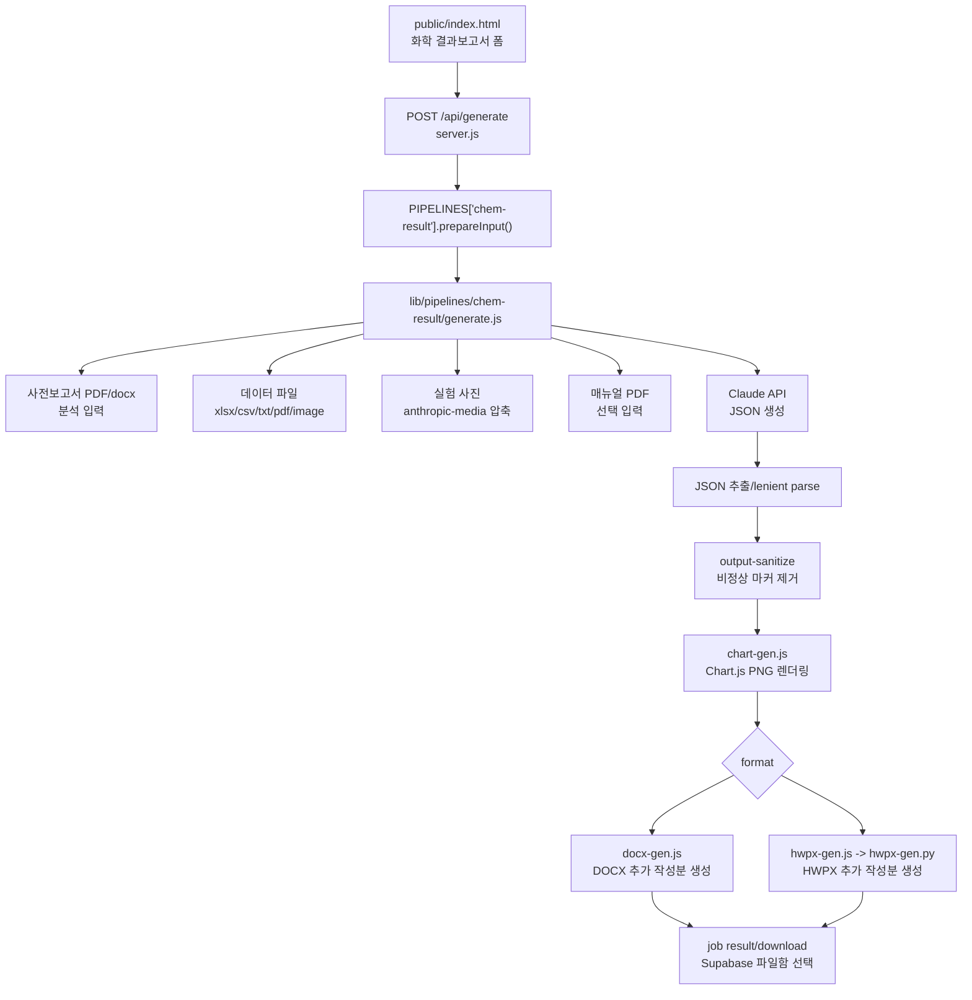

# 화학 결과보고서 생성 파이프라인 상세 문서

이 문서는 Render에서 운영되는 웹 서비스의 **화학 결과보고서(`chem-result`) 생성 기능**을 유지보수, 검증, 배포하기 위한 상세 기술 문서이다. GitHub에 공개되어도 되도록 API 키, 실제 사용자 계정, 실제 업로드 파일 경로, 개인 토큰은 포함하지 않는다.

## 1. 목적

화학 결과보고서 기능은 사용자가 업로드한 사전보고서, 실험 데이터, 실험 사진, 매뉴얼 PDF, 사용자 참고 메모를 바탕으로 Claude API를 호출하고, 사전보고서 뒤에 붙일 **결과 추가 작성분**을 `.docx` 또는 `.hwpx`로 생성한다.

핵심 목표는 다음과 같다.

- 사전보고서의 1~4번 섹션을 다시 쓰지 않고 5번 이후만 생성
- 실험 결과를 표와 그래프로 정리
- 평균, 표준편차, 백분율 오차 등 기본 통계 계산을 보고서에 반영
- 실험 사진을 결과 섹션에 적절히 삽입
- 논의 및 결론에서 이론과 실제 결과를 연결
- default 모드에서는 PCEI까지 작성
- HWPX 출력에서 수식, 이미지, 차트, 표가 깨지지 않게 렌더링

## 2. 전체 구조



## 3. 핵심 파일 지도

| 파일 | 역할 |
|---|---|
| `server.js` | Express 서버, 인증, `/api/generate`, job/SSE, 크레딧, pipeline registry |
| `public/index.html` | 화학 결과보고서 폼 UI, 클라이언트 검증, `FormData`, 진행 로그 표시 |
| `lib/pipelines/chem-result/generate.js` | Claude 입력 구성, 데이터/사진 처리, JSON 파싱, 차트 렌더링 |
| `lib/pipelines/chem-result/prompt.md` | 결과보고서 작성 규칙, 스타일 모드, JSON schema, 차트 spec |
| `lib/pipelines/chem-result/docx-gen.js` | 결과 추가 작성분 DOCX 렌더러 |
| `lib/pipelines/chem-result/hwpx-gen.js` | Node에서 Python HWPX 렌더러를 실행하는 wrapper |
| `lib/pipelines/chem-result/hwpx-gen.py` | 결과 추가 작성분 HWPX 렌더러 |
| `lib/pipelines/chem-result/chart-gen.js` | Claude chart spec을 Chart.js PNG로 렌더링 |
| `lib/pipelines/chem-pre/hwpx-gen.py` | 결과 HWPX가 재사용하는 공통 HWPX helper |
| `lib/equation/hwpx_equation_tool.py` | HWPX 수식 placeholder를 한컴 수식 객체로 변환 |
| `lib/excel-parser.js` | 엑셀/CSV를 Markdown table로 변환 |
| `lib/anthropic-media.js` | Claude vision 제한에 맞게 이미지 압축/리사이즈 |
| `lib/output-sanitize.js` | Claude 출력에 섞인 HTML/wiki 수식/비정상 마커 정리 |
| `lib/document-fonts.js` | 글꼴 선택값 정규화 |

## 4. Render 실행과 배포 전제

기본 실행:

```bash
npm install
npm start
```

HWPX 출력은 Python 의존성이 필요하다. Render 빌드에서 `.venv` 생성과 `requirements.txt` 설치가 정상 완료되어야 한다.

필수 환경변수:

| 변수 | 설명 |
|---|---|
| `ANTHROPIC_API_KEY` | Claude API 호출용 키 |
| `SESSION_SECRET` | Express session 서명용 secret |

운영 환경에서 함께 쓰는 변수:

| 변수 | 설명 |
|---|---|
| `SUPABASE_URL` | 사용자/파일함/크레딧 DB용 Supabase URL |
| `SUPABASE_SERVICE_KEY` | Supabase service role key |
| `MAX_TOKENS` | Claude 출력 token 상한, 기본 `32000` |
| `PYTHON_BIN` | HWPX generator용 Python 경로 override |
| `ANTHROPIC_IMAGE_MAX_BASE64_CHARS` | Claude image base64 제한 방어 |
| `ANTHROPIC_IMAGE_MAX_EDGE` | 이미지 리사이즈 최대 edge |
| `REPORT_STORAGE_BUCKET` | Supabase report bucket |
| `REPORT_RETENTION_HOURS` | 파일함 보관 시간 |
| `RESEND_API_KEY` | 건의사항 이메일 전송용 |
| `FEEDBACK_EMAIL_FROM` 또는 `RESEND_FROM` | 건의사항 발신자 |
| `FEEDBACK_EMAIL_TO` | 건의사항 수신자 |

주의: 실제 key 값은 `.env`, Render dashboard, Supabase dashboard에만 있어야 하며 GitHub 문서나 코드 diff에 넣지 않는다.

## 5. 사용자 입력 폼

웹 UI는 `public/index.html`의 화학 결과보고서 폼에서 관리된다.

서버로 전송되는 필드:

| field | type | 필수 여부 | 설명 |
|---|---|---|---|
| `type` | text | 필수 | `chem-result` |
| `preReport` | file | 필수 | 사전보고서 PDF 또는 DOCX |
| `data` | file | 선택 | `.xlsx`, `.xls`, `.csv`, `.txt`, `.png`, `.jpg`, `.jpeg` 중 1개 |
| `photos` | file[] | 선택 | 실험 사진 여러 장 |
| `manual` | file | 선택 | 실험 매뉴얼 PDF |
| `date` | text | 필수 UI | 실험 날짜 |
| `temperature` | text/number | 선택 | 실험 온도 |
| `pressure` | text/number | 선택 | 기압 |
| `model` | text | 선택 | 현재 서버 whitelist상 `claude-opus-4-8`만 허용 |
| `format` | text | 선택 | `docx` 또는 `hwpx` |
| `style` | text | 선택 | `default` 또는 `minimal` |
| `fontFace` | text | 선택 | 출력 글꼴 |
| `userNotes` | text | 선택 | AI 참고 메모 / 실험자 의견 |
| `copyrightAccepted` | text/bool | 필수 | 저작권 확인 |
| `academicIntegrityAccepted` | text/bool | 필수 | 학교/교사 기준 확인 |

현재 `data`는 서버 기준 단일 파일이다. 여러 데이터 파일을 동시에 받아야 한다면 `server.js`, UI, `generate.js`를 함께 확장해야 한다.

## 6. 서버 route 흐름

엔드포인트는 `server.js`의 `POST /api/generate`이다.

처리 순서:

1. `requireAuth`로 로그인 확인
2. `upload.any()`로 multer memory upload 처리
3. `req.body.type`으로 `chem-result` pipeline 선택
4. 저작권/학업윤리 동의 확인
5. 업로드 파일명을 `normalizeUploadFilename()`으로 mojibake 복구
6. `filesByField`로 fieldname별 파일 그룹화
7. `PIPELINES["chem-result"].prepareInput(filesByField, req.body)` 호출
8. 사용자 세션/Supabase에서 학번 보정
9. 일반 사용자 rate limit 확인
10. 일반 사용자 결과보고서 크레딧 잔액 확인
11. 출력 형식(`docx`/`hwpx`)과 모델 whitelist 확인
12. 같은 사용자의 기존 실행 중 job 자동 abort
13. 새 job 생성 후 `runGeneration()` 비동기 실행
14. 클라이언트에는 `{ jobId }` 반환
15. 클라이언트는 `/api/jobs/:id/events` SSE로 진행 로그 수신

## 7. chem-result pipeline registry

`server.js`의 `PIPELINES["chem-result"]`가 화학 결과보고서 전용 설정이다.

주요 설정:

- `label`: `화학 결과보고서`
- `filenamePrefix`: `결과`
- `filenameSourceField`: `preReport`
- `creditField`: `result`
- `prepareInput()`: 입력 파일 검증 및 `generateReportContent()` 인자 구성
- `generateContent`: `lib/pipelines/chem-result/generate.js`
- `generateDocx`: `lib/pipelines/chem-result/docx-gen.js`
- `generateHwpx`: `lib/pipelines/chem-result/hwpx-gen.js`

`prepareInput()` 검증:

- `preReport`가 없으면 reject
- 사전보고서는 `pdf` 또는 `docx`만 허용
- `data`는 첫 번째 파일만 사용
- `photos`는 여러 장 허용
- `manual`은 선택 입력
- `style`은 `minimal`일 때만 minimal, 그 외는 default
- `userNotes`는 최대 2000자

## 8. 중요한 현재 한계

사전보고서 입력은 서버에서 `pdf`와 `docx`를 모두 허용하지만, `generate.js`의 분석 입력은 현재 PDF만 Claude document block으로 보낸다.

현재 동작:

- `preReport`가 PDF이면 Claude document block으로 첨부
- `preReport`가 DOCX이면 attachment summary에 `"텍스트 추출 미구현, 빈 사전보고서로 처리"`라고 기록하고 실제 본문 추출은 하지 않음

따라서 결과보고서 품질 검증에서는 **사전보고서 PDF 업로드를 권장**한다. DOCX 사전보고서를 제대로 분석하려면 별도 DOCX text extraction을 구현해야 한다.

## 9. Job과 진행 로그

`runGeneration()`은 모든 파이프라인 공통 작업 실행기이다.

핵심 동작:

- `JOB_TIMEOUT_MS` 기준 timeout
- `AbortController`로 사용자 중단/자동 중단 처리
- `pushProgress()`로 SSE progress log 기록
- Claude content 생성
- `content.__allowHighlights`, `content.__fontFace`, `content.__studentInfo` metadata 부착
- `student_id`, `student_name`, `temperature`, `pressure`, `report_number` 주입
- HWPX/DOCX 빌드
- 다운로드용 `job.result`, `job.filename`, `job.mimeType` 설정
- Supabase 파일함 저장
- 사용량/비용 기록과 크레딧 차감

진행 로그 예:

```text
🚀 작업 시작 (화학 결과보고서, timeout: 8분)
🤖 모델: claude-opus-4-8 | 스타일: default
📎 출력 문서는 사전보고서 뒤에 붙일 결과 추가 작성분만 생성합니다.
📤 첨부: 사전보고서 PDF (...), 데이터 xlsx (... 자동 파싱), 실험 사진 2장, 사용자 참고 메모
✍️ 보고서 작성 시작
보고서 작성 중...
✓ Claude 응답 완료 ... — JSON 파싱 중
💰 텍스트 비용: ...
📋 콘텐츠 구조: 측정 실험 N개
📊 차트 N개 렌더링 중...
✓ 차트 N/N개 PNG 생성 완료
📄 .hwpx 파일 빌드 중...
✓ .hwpx 빌드 완료
🎉 전체 완료!
```

## 10. Claude 입력 구성

파일: `lib/pipelines/chem-result/generate.js`

`generateReportContent()`의 입력:

```js
{
  preReportBuffer,
  preReportName,
  dataBuffer,
  dataName,
  photos,
  manualBuffer,
  date,
  temperature,
  pressure,
  userNotes,
  onProgress,
  signal,
  model,
  style,
  outputFormat,
  allowHighlights
}
```

Claude user message는 다음 block들로 구성될 수 있다.

1. 사전보고서 PDF document block
2. 매뉴얼 PDF document block, 있을 때만
3. 데이터 파일 block
4. 실험 사진 image blocks
5. 사용자 참고 메모 text block
6. 최종 지시 text block

최종 지시에는 날짜, 온도, 기압, 첨부 파일 요약, JSON schema 준수, 데이터 부족 시 명시하라는 규칙이 포함된다.

## 11. 사전보고서 처리

사전보고서는 필수 입력이다.

PDF:

```js
{
  type: "document",
  source: {
    type: "base64",
    media_type: "application/pdf",
    data: preReportBuffer.toString("base64")
  }
}
```

DOCX:

- 현재 text extraction 미구현
- Claude에 실제 본문을 보내지 않음
- summary에 한계만 기록

결과보고서 prompt는 사전보고서에서 실험 목표, 이론, 기구/시약, 과정을 파악하고 5번 이후만 작성하라고 지시한다. 하지만 DOCX 입력에서는 이 분석 근거가 약해지므로 품질 저하가 발생할 수 있다.

## 12. 데이터 파일 처리

`dataBuffer`는 선택 입력이다. 파일 확장자별 동작이 다르다.

### 12.1 이미지 데이터

확장자:

- `.png`
- `.jpg`
- `.jpeg`

처리:

1. `prepareImageForAnthropic()`으로 Claude 제한에 맞게 압축/리사이즈
2. 성공하면 image block 추가
3. 실패하면 text block으로 제외 사유 전달

사용 목적:

- 표 스크린샷에서 숫자 읽기
- 그래프 스크린샷에서 축/단위/추세 읽기
- 실험 결과 사진에서 관찰 내용 확인

### 12.2 PDF 데이터

확장자:

- `.pdf`

처리:

- Claude document block으로 첨부

### 12.3 텍스트 데이터

확장자:

- `.txt`

처리:

- UTF-8로 읽고 최대 50000자만 text block으로 첨부

주의:

- 현재 `.md`는 chem-result data accept 목록에 없다.
- EUC-KR fallback은 물리 결과보고서 쪽 텍스트 처리만큼 정교하지 않다.

### 12.4 엑셀/CSV 데이터

확장자:

- `.xlsx`
- `.xls`
- `.csv`

처리:

1. `parseToMarkdown(dataBuffer, dataExt)` 호출
2. sheet 수, row 수 요약
3. Markdown table text block으로 Claude에 전달
4. 평균, 표준편차, 백분율 오차를 직접 계산하라고 지시

현재 chem-result는 물리 결과보고서처럼 canonical table을 출력 후 강제 보정하는 로직은 없다. 따라서 수치 검증은 Claude 출력과 원본 엑셀을 비교하는 테스트가 필요하다.

## 13. 실험 사진 처리

`photos`는 여러 장 가능하다.

처리:

1. 각 사진에 대해 `prepareImageForAnthropic(photo)` 실행
2. 성공하면 image block 추가
3. 너무 크거나 변환 실패하면 제외 사유 text block 추가
4. 전송/자동 축소/제외 수를 attachment summary에 기록

렌더링:

- Claude JSON의 `data.experiments[].photo_indices`가 사진 번호를 지정
- `docx-gen.js`는 `content.__photos`에서 해당 사진을 찾아 삽입
- `hwpx-gen.js`는 사진을 base64로 payload에 복사
- `hwpx-gen.py`는 `photo_indices`를 기준으로 HWPX에 이미지 삽입

주의:

- `photo_indices`에 포함되지 않은 사진은 보고서에 표시되지 않는다.
- 사진이 어느 실험에도 대응하지 않으면 빈 배열이어도 된다.
- 이미지가 Claude 입력에서 제외되면 보고서에도 적절히 반영하기 어렵다.

## 14. 사용자 메모 처리

`buildUserNotesBlock(userNotes)`는 사용자가 입력한 메모를 별도 block으로 만든다.

메모의 역할:

- 실제 관찰 내용
- 데이터 처리 판단
- 제외한 값의 이유
- 결론에서 강조하고 싶은 의견
- 오차 분석 후보
- 개선점 또는 재측정 과정

제한:

- 메모는 system prompt를 대체하지 않는다.
- 첨부 데이터보다 우선하면 안 된다.
- 메모를 그대로 복사하지 않고 보고서 문체로 바꾼다.
- 같은 내용을 여러 절에서 반복하지 않는다.
- 데이터가 없으면 조치 때문에 분산/오차/수율이 얼마나 개선됐다고 단정하지 않는다.
- 메모에 없는 수치, 제외 횟수, 새 실험 절차, 관찰 사실은 만들지 않는다.

이 제한은 메모가 AI 특유로 과대하게 반영되는 문제를 줄이기 위한 핵심 guard이다.

## 15. System prompt 구성

`buildSystemPrompt(style, outputFormat, { allowHighlights })`는 다음을 합친다.

1. 역할 설명
2. `prompt.md` 전체 내용
3. 작업 절차
4. 출력 범위
5. 스타일 모드 지시
6. 출력 형식 지시
7. JSON code block 단일 출력 규칙

출력 범위 핵심:

- 결과물은 사전보고서 뒤에 붙일 추가 작성분
- 1~4번 섹션은 최종 문서 본문에 다시 쓰지 않음
- 최종 렌더링 대상은 `5. 실험 결과`, `6. 논의 및 결론`, `7. 참고 문헌`, `추가 작성(PCEI)`
- JSON schema 호환을 위해 `purpose`, `theory`, `apparatus`, `chemicals`, `procedure`는 존재할 수 있지만 가능하면 빈 배열

`allowHighlights`:

- 관리자이면 `**내용**` 하이라이트 marker 허용
- 일반 사용자이면 하이라이트 marker 사용 금지 문구로 치환

## 16. 스타일 모드

### 16.1 default

`default`는 학교 공식 양식 풀버전이다.

특징:

- 5번 이후 추가 작성분만 생성
- `5. 실험 결과`
- `6. 논의 및 결론`
- `7. 참고 문헌`
- `추가 작성(PCEI)`
- 번호 체계: `1.` → `가.` → `(1)` → `①`
- 분석과 오차 설명을 풍부하게 작성

적합한 경우:

- 정식 결과보고서 추가 작성분
- 데이터와 사진이 충분한 실험
- PCEI까지 필요한 경우

### 16.2 minimal

`minimal`은 필요한 내용만 적는 학생 보고서 스타일이다.

특징:

- 표지/목차/헤더 없음
- 사전보고서 뒤에 바로 이어 붙일 수 있게 5번부터 시작
- `가.`, `나.` 헤더 금지
- 결론과 논의를 통합할 수 있음
- PCEI는 `{}` 빈 객체
- 한국어 용어 뒤 영어 병기 금지
- 도입부와 마무리 문장 남용 금지

적합한 경우:

- 짧고 실용적인 결과 추가 작성분
- 데이터 양이 적거나 간단한 실험
- PCEI가 필요 없는 경우

## 17. 출력 JSON schema

Claude 출력은 반드시 하나의 JSON code block이어야 한다.

핵심 schema:

```json
{
  "title_kr": "한글 실험 제목",
  "title_en": "English experiment title",
  "date": "YYYY/MM/DD",
  "conditions": {
    "temperature": "22.5°C",
    "pressure": "1013.2 hPa"
  },
  "purpose": [],
  "theory": [],
  "apparatus": [],
  "chemicals": [],
  "procedure": [],
  "data": {
    "summary": "측정 데이터 개요",
    "experiments": [
      {
        "name": "실험 A",
        "table": {
          "headers": ["측정 #", "값"],
          "rows": [["1차", "10.00"]]
        },
        "stats": [
          { "label": "평균", "value": "10.00 mL" }
        ],
        "photo_indices": [0],
        "photo_caption": "실험 사진 설명"
      }
    ],
    "summary_table": {
      "headers": ["항목", "평균", "오차"],
      "rows": [["시료 A", "10.00", "0.5%"]]
    },
    "charts": [
      {
        "title": "그래프 제목",
        "type": "bar",
        "x_label": "x축",
        "y_label": "y축",
        "x_values": ["A", "B"],
        "series": [
          { "label": "평균값", "values": [1.0, 2.0] }
        ],
        "reference_line": { "value": 1.5, "label": "이론값" },
        "caption": "그래프 설명"
      }
    ]
  },
  "discussion": {
    "analysis": ["결과 분석"],
    "errors": ["오차 원인"],
    "improvements": ["개선 방안"]
  },
  "references": ["참고문헌"],
  "pcei": {
    "perception": "관찰",
    "curiosity": "의문",
    "exploration": "탐구",
    "insight": "통찰"
  }
}
```

렌더러가 5번 이후 섹션 번호를 붙인다. Claude 출력 내부에서 제목을 중복 작성하지 않도록 prompt가 제한한다.

## 18. 데이터 처리 규칙

`prompt.md`의 기본 통계 규칙:

- 평균: `Σxᵢ / n`
- 표준편차: sample standard deviation, `n-1`로 나누는 베셀 보정
- 백분율 오차: `|평균 - 이론값| / 이론값 × 100`
- 질량: 소수점 3자리
- 부피: 소수점 4자리
- 평균/표준편차: 소수점 4자리
- 백분율 오차: 소수점 2자리

주의:

- 데이터가 부족하면 `data.summary`에 부족하다고 명시한다.
- 임의의 이론값을 만들면 안 된다.
- 사진에서 보이지 않는 숫자는 추정하지 않는다.
- 메모에 있는 정성 관찰은 정량 데이터처럼 과장하지 않는다.

## 19. 차트 처리

파일: `lib/pipelines/chem-result/chart-gen.js`

Claude는 `data.charts[]`에 chart spec을 넣고, 서버가 Chart.js로 PNG를 렌더링한다.

지원 type:

- `bar`
- `line`
- `scatter`

지원 필드:

| 필드 | 설명 |
|---|---|
| `title` | 차트 제목 |
| `type` | `bar`, `line`, `scatter` |
| `x_label` | x축 레이블 |
| `y_label` | y축 레이블 |
| `x_values` | category 또는 x축 값 |
| `series[].values` | bar/line 값 |
| `series[].points` | scatter 점 목록 |
| `trendline` | 선형 회귀선 |
| `reference_line` | 이론값 등 수평 점선 |
| `caption` | 그림 설명 |

렌더링 흐름:

1. `generate.js`가 `parsed.data.charts` 확인
2. 각 chart에 대해 `renderChart(chart)` 호출
3. 성공하면 `chart.pngBuffer`를 non-enumerable property로 부착
4. DOCX/HWPX 렌더러가 이미지로 삽입

차트 생성 실패:

- `renderChart()`가 `null`을 반환할 수 있다.
- DOCX에서는 렌더 실패 문구가 들어갈 수 있다.
- HWPX에서는 `png_base64`가 없으면 차트가 생략될 수 있다.

## 20. DOCX 생성

파일: `lib/pipelines/chem-result/docx-gen.js`

현재 결과보고서 DOCX는 append-only 구조를 사용한다.

default 흐름:

- `buildAppendOnlyChildren(content)`
- `buildData(content, allPhotos, figCounter)`
- `buildDiscussion(content)`
- `buildReferences(content)`
- `buildPCEI(content)`

minimal 흐름:

- `buildMinimalAppendOnlyChildren(content)`
- `buildMinimalData(content, allPhotos, figCounter)`
- `buildMinimalDiscussion(content)`
- `buildMinimalReferences(content)`

중요:

- `buildHeader`, `buildPurpose`, `buildTheory`, `buildApparatusAndChemicals`, `buildProcedure` 같은 full report builder가 파일 안에 남아 있지만, 결과 추가 작성분에서는 append-only builder가 사용된다.
- 따라서 결과보고서 출력에 실험목표/이론/기구/시약/과정이 다시 들어가면 분기나 prompt를 의심해야 한다.

DOCX 특징:

- 표 생성
- summary table 생성
- experiment별 stats 출력
- 사진 삽입
- chart PNG 삽입
- 참고문헌 처리
- PCEI 출력
- `parseRichText()`로 아래첨자/위첨자/italic/highlight marker 처리

## 21. HWPX 생성

파일: `lib/pipelines/chem-result/hwpx-gen.js`, `hwpx-gen.py`

### 21.1 Node wrapper

`hwpx-gen.js`:

- Python 경로 탐색
- content를 JSON clone
- `__style`, `__fontFace`, `__allowHighlights` metadata 복사
- `__photos[].data_base64`를 payload에 복사
- `data.charts[].pngBuffer`를 `png_base64`로 복사
- Python script stdin에 JSON 전달
- stdout의 HWPX bytes 수집

### 21.2 Python renderer

`hwpx-gen.py`:

- `chem-pre/hwpx-gen.py`를 공통 helper로 import
- 결과보고서 전용 section 생성
- 표 생성
- 사진 삽입
- chart PNG 삽입
- discussion/errors/improvements 출력
- references 출력
- PCEI 출력
- 수식 postprocess
- BinData manifest 보정

주의:

- 결과 HWPX는 사진과 차트가 실제 binary item으로 들어가야 한다.
- `pre.ensure_embedded_bindata_items()` 호출이 빠지면 HWPX에서 이미지가 보이지 않을 수 있다.
- 공통 helper 수정은 화학 사전/물리 결과에도 영향을 줄 수 있다.

## 22. HWPX 이미지와 차트

이미지 삽입 흐름:

1. Node wrapper가 `photo.buffer`를 base64로 변환
2. Python renderer가 base64 decode
3. `add_picture()`가 이미지 크기 확인
4. HWPX BinData로 추가
5. `hp:pic` shape 생성
6. caption 문단 생성
7. 저장 후 `ensure_embedded_bindata_items()`로 manifest 보정

지원 format:

- PNG
- JPG/JPEG
- GIF
- BMP

검증 포인트:

- HWPX ZIP 안에 BinData가 실제 존재하는가
- `Contents/content.hpf`에 BinData item이 등록되어 있는가
- section XML에서 pic shape가 해당 BinData를 참조하는가
- macOS 한글/Windows 한컴에서 이미지가 보이는가

## 23. HWPX 수식 처리

HWPX 생성 후 `pre._postprocess_equations(target)`가 실행된다.

처리 대상:

- `{{EQ:...}}`
- `{{EQN:...}}`
- `{{EQ-LATEX:...}}`
- `{{EQN-LATEX:...}}`

금지:

- `{{MATH:...}}`
- `{{FORMULA:...}}`
- `[[수식]]`
- HTML `<sub>`, `<sup>`

실패를 무시하면 raw marker가 문서에 남는다. HWPX 수식 postprocess 실패는 fatal로 보는 것이 맞다.

검증할 표현:

- `H_{2}O`
- `CO_{2}`
- `10^{-3}`
- `K_{c}`
- `{{EQ:...}}` 독립 반응식
- `{{EQ:{a} over {b}}}` 분수식

## 24. 파일명과 저장

결과보고서 파일명은 `filenamePrefix = "결과"`와 사전보고서 filename에서 추출한 번호를 기반으로 만들어진다. 최종 확장자는 요청 format에 따라 `.docx` 또는 `.hwpx`이다.

Supabase 파일함:

- 생성 성공 후 `supa.saveReportFile()` 호출
- 기본 24시간 보관
- 사용자별 최대 파일 수 유지
- 저장 실패는 생성 실패가 아니라 warning progress

## 25. 오류 유형과 원인

| 증상 | 가능 원인 | 확인 위치 |
|---|---|---|
| `사전보고서 파일을 업로드하세요.` | `preReport` field 누락 | `server.js` |
| `사전보고서는 PDF 또는 docx만 가능합니다.` | preReport 확장자 오류 | `server.js` |
| DOCX 사전보고서 입력 시 내용 부실 | DOCX text extraction 미구현 | `generate.js` |
| `image exceeds 5 MB maximum` | 이미지 압축 전송 실패 또는 제한 초과 | `anthropic-media.js` |
| 데이터가 반영되지 않음 | data 확장자 미지원, 엑셀 파싱 실패, 사진 제외 | `generate.js`, `excel-parser.js` |
| JSON 코드 블록 없음 | Claude 출력 형식 위반 | `prompt.md`, `generate.js` |
| JSON 파싱 실패 | trailing comma, 제어문자, schema 파손 | `json-sanitize.js` |
| 차트가 없음 | `data.charts`가 빈 배열, chart spec 부족 | `prompt.md`, `chart-gen.js` |
| 차트 렌더 실패 | Chart.js config 오류, 숫자가 문자열 | `chart-gen.js` |
| 사진이 출력되지 않음 | `photo_indices` 누락 또는 image base64 전달 실패 | `generate.js`, renderers |
| HWPX가 안 열림 | XML 구조, BinData, 수식 object 문제 | `hwpx-gen.py`, 공통 helper |
| HWPX 이미지가 비어 있음 | `content.hpf` BinData item 누락 | `ensure_embedded_bindata_items()` |
| 실험목표/이론이 다시 출력됨 | append-only 분기 깨짐 또는 prompt 위반 | `docx-gen.js`, `hwpx-gen.py`, `prompt.md` |

## 26. 로컬 점검 명령

문법 확인:

```bash
node -c server.js
node -c lib/pipelines/chem-result/generate.js
node -c lib/pipelines/chem-result/docx-gen.js
node -c lib/pipelines/chem-result/hwpx-gen.js
node -c lib/pipelines/chem-result/chart-gen.js
python3 -m py_compile lib/pipelines/chem-result/hwpx-gen.py
python3 -m py_compile lib/pipelines/chem-pre/hwpx-gen.py
python3 -m py_compile lib/equation/hwpx_equation_tool.py
```

서버 실행:

```bash
npm start
```

HWPX Python 의존성 확인:

```bash
.venv/bin/python3 - <<'PY'
import hwpx
import lxml
print("python hwpx/lxml OK")
PY
```

민감정보 포함 여부 점검:

```bash
git status --short
git diff --cached
git diff
git ls-files | grep -E '(^|/)(\\.env|.*key.*|.*secret.*)'
rg -n "sk-ant-|SUPABASE_SERVICE_KEY|RESEND_API_KEY|SESSION_SECRET|eyJ|password|패스워드|비밀번호" .
```

`rg` 결과에는 placeholder 문서가 잡힐 수 있다. 실제 secret 값인지 확인한다.

## 27. 실제 기능 검증 체크리스트

최소 테스트 조합:

- 사전보고서 PDF만 사용
- 사전보고서 PDF + 엑셀 데이터
- 사전보고서 PDF + CSV 데이터
- 사전보고서 PDF + 텍스트 데이터
- 사전보고서 PDF + 데이터 이미지
- 사전보고서 PDF + 실험 사진 여러 장
- 사전보고서 PDF + 매뉴얼 PDF
- 사용자 메모 포함
- 데이터 파일 없이 메모만으로 정성 결과 작성
- `default` style
- `minimal` style
- `.docx` 출력
- `.hwpx` 출력

출력 검증:

- 문서가 5번 이후 추가 작성분으로 시작하는가
- 실험목표/이론/기구/시약/실험 과정이 중복 출력되지 않는가
- 날짜/온도/기압이 헤더 또는 조건 기록에 반영되는가
- 데이터 표가 업로드 원본과 일치하는가
- 평균/표준편차/백분율 오차 계산이 맞는가
- 그래프가 실제 이미지로 들어가는가
- 그래프 축 label과 단위가 있는가
- 사진이 `photo_indices`에 맞게 들어가는가
- 사진 caption이 과장되지 않는가
- 논의가 이론과 실제 결과를 연결하는가
- 오차 분석이 구체적인 원인과 메커니즘을 포함하는가
- 개선 방안이 실험 조건과 맞는가
- default 모드에서 PCEI가 존재하는가
- minimal 모드에서 PCEI가 출력되지 않는가
- raw HTML 태그, wiki 수식 marker, Markdown pipe table이 남지 않는가
- DOCX가 Word/한글에서 열리는가
- HWPX가 macOS 한글과 Windows 한컴에서 열리는가
- HWPX에 raw `{{EQ...}}` marker가 남지 않는가
- 이미지가 HWPX에서 보이는가

## 28. Render 로그 확인 포인트

Render dashboard에서 확인할 로그:

- 서버 시작 시 env 경고 여부
- `사전보고서 PDF` 또는 DOCX 한계 summary
- 데이터 파싱 성공/실패 로그
- 이미지 자동 축소/제외 로그
- Claude 응답 완료 및 token/cost 로그
- 콘텐츠 구조 로그
- 차트 렌더링 로그
- HWPX/DOCX 빌드 완료 로그
- Supabase 파일함 저장 warning

로그상 생성은 완료됐는데 파일이 안 열리면 HWPX ZIP/XML/수식/BinData 검증을 먼저 한다.

## 29. GitHub 배포 전 안전 체크리스트

배포 전 반드시 확인:

1. `.env`, `.env.local`, 실제 key 파일이 tracked인지 확인
2. `git status --short`에서 의도하지 않은 샘플 보고서/사용자 파일이 없는지 확인
3. `git diff`에 API key, Supabase service key, session secret, 개인 계정 정보가 없는지 확인
4. `node_modules/`, `.venv/`, `tmp/`, 다운로드 파일이 포함되지 않는지 확인
5. 샘플 보고서가 필요하면 개인정보 제거본만 별도 관리
6. Render 환경변수는 GitHub가 아니라 Render dashboard에만 입력
7. 배포 후 Render build log 확인
8. 배포 후 관리자 계정과 일반 계정 각각 1회 생성 테스트

권장 `.gitignore` 대상:

```text
node_modules/
.env
.env.local
*.log
.DS_Store
.vscode/
.idea/
dist/
tmp/
__pycache__/
*.pyc
.venv/
```

## 30. 수정 원칙

화학 결과보고서를 고칠 때는 아래 원칙을 따른다.

- append-only 원칙을 지킨다. 결과보고서는 사전보고서 전체를 다시 만들지 않는다.
- 데이터 처리 오류는 먼저 `generate.js`의 확장자별 입력 구성과 `excel-parser.js`를 확인한다.
- 사진/이미지 오류는 `anthropic-media.js`와 renderer의 image payload 전달을 함께 확인한다.
- 차트 오류는 Claude chart spec과 `chart-gen.js`를 나눠 확인한다.
- HWPX 이미지 오류는 BinData 파일과 `content.hpf` 등록을 같이 본다.
- DOCX 사전보고서 분석 품질 문제를 prompt 문제로 오인하지 않는다. 현재 DOCX text extraction이 없다.
- 사용자 메모는 추가 맥락이지 사실 생성 근거가 아니다.
- `chem-pre/hwpx-gen.py` 공통 helper 수정 전 화학 사전/물리 결과 영향까지 고려한다.
- 결과 데이터는 원본 파일에 없는 값을 만들어내면 안 된다.

## 31. 향후 개선 후보

- 사전보고서 DOCX text extraction 구현
- chem-result도 여러 data 파일 입력 허용
- 엑셀/CSV canonical data 기반 출력 후 수치 검증 추가
- chart spec schema validation 추가
- 사진 index와 실제 사진 삽입 여부 자동 검사
- HWPX 생성 후 raw marker 검사 자동화
- HWPX BinData manifest validation 자동화
- 데이터 없이 메모만 있는 정성 결과보고서 전용 prompt 분기
- fixture 기반 regression test 추가
- Render 배포 후 smoke test script 작성

## 32. 관련 문서

- `CLAUDE.md`: repo 안에서 Claude/Codex가 작업할 때 보는 상위 지침
- `docs/chem-pre-pipeline.md`: 화학 사전보고서 생성 파이프라인
- `docs/phys-result-pipeline.md`: 물리 결과보고서 생성 파이프라인
- `lib/pipelines/chem-result/prompt.md`: Claude system prompt 원문
- `README.md`: 서비스 배포와 운영 개요
