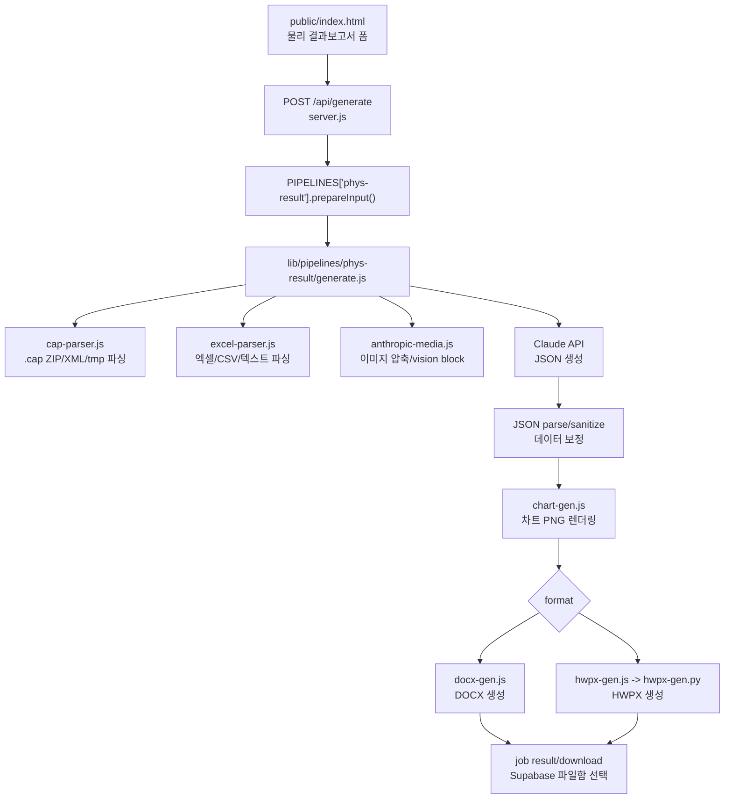

# 물리 결과보고서 생성 파이프라인 상세 문서

이 문서는 Render에서 운영되는 웹 서비스의 **물리 결과보고서(`phys-result`) 생성 기능**을 유지보수, 검증, 배포하기 위한 상세 기술 문서이다. GitHub에 공개되어도 되도록 API 키, 계정 비밀번호, 실제 사용자 업로드 파일 경로, 개인 토큰은 포함하지 않는다.

## 1. 목적

물리 결과보고서 기능은 사용자가 업로드한 PASCO Capstone `.cap` 파일, 엑셀/CSV/텍스트 데이터, 실험 매뉴얼 PDF, 사진/그래프/표 스크린샷, 사용자 참고 메모를 바탕으로 Claude API를 호출하고, 결과를 `.docx` 또는 `.hwpx` 보고서로 생성한다.

핵심 목표는 다음과 같다.

- (영재학교)과학고 일반물리학실험 결과보고서 양식에 맞는 구조 생성
- 실험 결과를 표와 그래프로 제시
- 물리 이론, 오차 분석, 문제 인식 및 해결을 평가기준에 맞게 반영
- `.cap` 파일과 사용자가 직접 정리한 데이터가 충돌할 때 원본 데이터 기준으로 방어
- HWPX 출력에서 한컴 문서가 열리지 않거나 수식/이미지/표가 깨지는 문제 방지

## 2. 전체 구조



## 3. 핵심 파일 지도

| 파일 | 역할 |
|---|---|
| `server.js` | Express 서버, 인증, `/api/generate`, job/SSE, 크레딧, 파일 저장, pipeline registry |
| `public/index.html` | 물리 결과보고서 폼 UI, 클라이언트 검증, `FormData`, 진행 로그 표시 |
| `lib/pipelines/phys-result/generate.js` | 물리 결과보고서 Claude 입력 구성, JSON 파싱, 데이터 보정, 차트 렌더링 |
| `lib/pipelines/phys-result/prompt.md` | Claude system prompt 원문, 보고서 구조/평가기준/JSON schema |
| `lib/pipelines/phys-result/cap-parser.js` | `.cap` 파일 내부 ZIP/XML/tmp 데이터 파싱 |
| `lib/pipelines/phys-result/docx-gen.js` | DOCX 렌더러 |
| `lib/pipelines/phys-result/hwpx-gen.js` | Node에서 Python HWPX 렌더러를 실행하는 wrapper |
| `lib/pipelines/phys-result/hwpx-gen.py` | 물리 결과보고서 HWPX 렌더러 |
| `lib/pipelines/phys-result/templates/result-report-template.hwpx` | 물리 결과보고서 HWPX 기준 양식. 공개 저장소에는 포함하지 않으며, 권한 있는 배포자가 별도로 넣으면 사용됨 |
| `lib/pipelines/phys-result/form.pdf` | Claude 입력에 자동 첨부되는 결과보고서 양식 PDF. 공개 저장소에는 포함하지 않으며, 없으면 첨부 없이 진행 |
| `lib/equation/hwpx_equation_tool.py` | HWPX 수식 placeholder를 한컴 수식 객체로 변환 |
| `lib/excel-parser.js` | 엑셀/CSV를 Markdown table과 구조화 table로 변환 |
| `lib/anthropic-media.js` | Claude vision 제한에 맞게 이미지 압축/리사이즈 |
| `lib/pipelines/chem-result/chart-gen.js` | 물리에서도 재사용하는 Chart.js PNG 렌더러 |
| `lib/parser.js` | DOCX용 rich text marker 파서 |
| `lib/document-fonts.js` | 글꼴 선택값 정규화 |

## 4. Render 실행과 배포 전제

이 서비스는 Render Web Service에서 Node.js 앱으로 실행된다.

기본 실행:

```bash
npm install
npm start
```

`package.json`의 `postinstall`은 Python virtualenv를 만들고 `requirements.txt`를 설치한다. HWPX 출력은 Python 의존성(`python-hwpx`, `lxml`)이 필요하므로 Render 빌드 로그에서 venv 생성 실패가 없는지 확인해야 한다.

필수 환경변수:

| 변수 | 설명 |
|---|---|
| `ANTHROPIC_API_KEY` | Claude API 호출용 키 |
| `SUPABASE_URL` | 사용자/파일함/크레딧 DB용 Supabase URL |
| `SUPABASE_SERVICE_KEY` | Supabase service role key |
| `SESSION_SECRET` | Express session 서명용 secret |
| `NODE_ENV=production` | production cookie 설정 |

선택 환경변수:

| 변수 | 기본값 | 설명 |
|---|---:|---|
| `PORT` | `3000` | Render가 자동 주입 |
| `JOB_TIMEOUT_MS` | `480000` | 작업 timeout, 기본 8분 |
| `MAX_TOKENS` | `32000` | Claude 출력 token 상한 |
| `PYTHON_BIN` | 자동 탐색 | HWPX generator용 Python 경로 |
| `ANTHROPIC_IMAGE_MAX_BASE64_CHARS` | `4900000` | Claude image base64 제한 방어 |
| `ANTHROPIC_IMAGE_MAX_EDGE` | `2200` | 이미지 리사이즈 최대 edge |
| `REPORT_STORAGE_BUCKET` | `generated-reports` | Supabase report bucket |
| `REPORT_RETENTION_HOURS` | `24` | 파일함 보관 시간 |
| `REPORT_MAX_FILES_PER_USER` | `3` | 사용자별 보관 파일 수 |
| `RESEND_API_KEY` | 없음 | 건의사항 이메일 전송 |
| `FEEDBACK_EMAIL_FROM` 또는 `RESEND_FROM` | 없음 | 발신자 |
| `FEEDBACK_EMAIL_TO` | 없음 | 수신자 |

주의: 실제 key 값은 `.env`, Render dashboard, Supabase dashboard에만 있어야 하며 GitHub에 올리지 않는다.

## 5. 사용자 입력 폼

웹 UI는 `public/index.html`의 물리 결과보고서 폼에서 관리된다.

서버로 전송되는 필드:

| field | type | 필수 여부 | 설명 |
|---|---|---|---|
| `type` | text | 필수 | `phys-result` |
| `cap` | file | 조건부 | PASCO Capstone `.cap` |
| `data` | file[] | 조건부 | `.xlsx`, `.xls`, `.csv`, `.txt`, `.md`, 여러 개 가능 |
| `manual` | file | 선택 | 실험 매뉴얼 PDF |
| `photos` | file[] | 조건부/선택 | 실험 사진, 데이터 표/그래프 스크린샷 |
| `date` | text | 선택 | 보고서 날짜 |
| `studentId` | text | 필수 | 학번. 개인 설정 저장값 fallback 가능 |
| `model` | text | 선택 | 현재 `claude-opus-4-8`만 허용 |
| `format` | text | 선택 | `docx` 또는 `hwpx` |
| `fontFace` | text | 선택 | `Malgun Gothic`, `Nanum Gothic`, `Nanum Myeongjo`, `함초롬바탕` |
| `userNotes` | text | 선택 | AI 참고 메모 / 실험자 의견 |
| `copyrightAccepted` | text/bool | 필수 | 저작권 확인 |
| `academicIntegrityAccepted` | text/bool | 필수 | 학교/교사 기준 확인 |

물리 결과보고서는 다음 중 하나 이상이 있어야 한다.

- `.cap`
- 엑셀/CSV/텍스트 데이터
- 사진/표/그래프 스크린샷

## 6. 서버 route 흐름

엔드포인트는 `server.js`의 `POST /api/generate`이다.

처리 순서:

1. `requireAuth`로 로그인 확인
2. `upload.any()`로 multer memory upload 처리
3. `req.body.type`으로 pipeline 선택
4. 저작권/학업윤리 동의 확인
5. 업로드 파일명을 `normalizeUploadFilename()`으로 mojibake 복구
6. `filesByField`로 fieldname별 파일 그룹화
7. `PIPELINES["phys-result"].prepareInput(filesByField, req.body)` 호출
8. 사용자 세션/Supabase에서 학번 보정
9. 일반 사용자 rate limit 확인
10. 일반 사용자 크레딧 잔액 확인
11. 출력 형식(`docx`/`hwpx`)과 모델 whitelist 확인
12. 같은 사용자의 기존 실행 중 job 자동 abort
13. 새 job 생성 후 `runGeneration()` 비동기 실행
14. 클라이언트에는 `{ jobId }` 반환
15. 클라이언트는 `/api/jobs/:id/events` SSE로 진행 로그 수신

## 7. 물리 pipeline registry

`server.js`의 `PIPELINES["phys-result"]`가 물리 결과보고서 전용 설정이다.

주요 설정:

- `label`: `물리 결과보고서`
- `filenamePrefix`: `물리결과`
- `filenameSourceField`: `cap`
- `creditField`: `result`
- `prepareInput()`: 입력 파일 검증 및 `generateReportContent()` 인자 구성
- `buildFilename()`: `{학번}{이름}_{실험제목}.{ext}` 형식
- `generateContent`: `lib/pipelines/phys-result/generate.js`
- `generateDocx`: `lib/pipelines/phys-result/docx-gen.js`
- `generateHwpx`: `lib/pipelines/phys-result/hwpx-gen.js`

`prepareInput()` 검증:

- `.cap` 확장자가 아니면 reject
- `data`는 `xlsx/xls/csv/txt/md`만 허용
- `cap`, `data`, `photos`가 모두 없으면 reject
- `userNotes`는 `normalizeUserNotes()`로 최대 2000자
- `studentId`는 최대 20자

## 8. Job과 진행 로그

`runGeneration()`은 실제 생성 작업을 수행한다.

핵심 동작:

- `JOB_TIMEOUT_MS` 기준 timeout
- `AbortController`로 사용자 중단/자동 중단 처리
- `pushProgress()`로 SSE progress log 기록
- Claude content 생성
- `content.__allowHighlights`, `content.__fontFace`, `content.__studentInfo` 같은 non-enumerable metadata 부착
- HWPX/DOCX 빌드
- 다운로드용 `job.result`, `job.filename`, `job.mimeType` 설정
- Supabase가 켜져 있으면 파일함에 24시간 저장
- 사용량/비용 기록과 크레딧 차감

진행 로그 예:

```text
🚀 작업 시작 (물리 결과보고서, timeout: 8분)
🤖 모델: claude-opus-4-8 | 양식: 기본
📦 .cap 파일 파싱 중... (2476KB)
✓ .cap 파싱 완료 — 페이지 10, 센서 1, dataset 69, 내장이미지 5
📤 첨부: .cap 파싱 결과 텍스트, 데이터.xlsx (...), 양식 PDF (내장), 사용자 참고 메모
✍️ 보고서 작성 시작
보고서 작성 중...
✓ Claude 응답 완료 ... — JSON 파싱 중
📋 콘텐츠: 실험 파트 N개, 차트 N개
📊 차트 N개 렌더링 중...
📄 .hwpx 파일 빌드 중...
✓ .hwpx 빌드 완료
🎉 전체 완료!
```

## 9. `.cap` 파싱 세부 구조

파일: `lib/pipelines/phys-result/cap-parser.js`

PASCO Capstone `.cap` 파일은 ZIP archive로 취급한다.

예상 구조:

```text
main.xml
data/Z_*.tmp
images/*.png 또는 images/*.jpg
```

### 9.1 `main.xml`

`parseCap(buffer)`는 `JSZip.loadAsync()`로 archive를 열고 `main.xml`을 읽는다.

`main.xml`에서 추출하는 정보:

- `WorkbookPage`
  - 워크북 페이지 이름
  - Part I/Part II 같은 실험 파트 판단 근거
- `Sensor`
  - 센서명
  - sample period
  - measurement 목록
- `CSTextEdit`
  - 페이지 안 텍스트/질문/설명
- `DisplayTitle`
  - 페이지 제목
- `DataSource`
  - measurement name
  - symbol/unit
  - dependent/independent storage element
  - `data/*.tmp` 파일명과 measurement 의미 매핑

### 9.2 `.tmp` 포맷 판별

`detectTmpFormat(buf)`는 첫 non-zero uint32 little-endian 값으로 포맷을 판별한다.

| 값 | 포맷 | 설명 |
|---:|---|---|
| `1` | `timeseries` | 센서 시계열. 12-byte record: `[uint32 tag, double value]` |
| `2` | `userdata` | 사용자가 Capstone 표에 직접 입력한 값. TLV/UTF-16LE |
| 그 외 | `unknown`/`empty` | skip |

### 9.3 시계열 데이터

`decodeTimeseries(buf)`:

- record size: 12 bytes
- tag가 `1`인 값만 유효 샘플
- double little-endian 값 추출
- `MAX_VALUES_PER_DATASET=200000`
- min/max/sample/valid_count 계산

시계열은 Force, Velocity, Position, Angular Velocity 같은 센서 데이터일 수 있다.

### 9.4 사용자 입력 표 데이터

`decodeUserData(buf)`:

- TLV: `[type=2, length, UTF-16LE string]`
- 가변 길이 문자열과 고정 길이 반복 문자열을 모두 처리
- 문자열에서 null 제거
- 숫자로 해석 가능한 값은 `values`
- 숫자가 아닌 값은 `string_values`

Physical Pendulum처럼 사용자가 Capstone 표에 직접 입력한 값이 중요한 실험에서는 이 경로가 핵심이다. 이전에는 시계열만 처리해 사용자 입력 표가 누락되는 문제가 있었다.

### 9.5 Prompt 요약

`summarizeForPrompt(parsed)`는 파싱 결과를 Claude가 읽을 수 있는 텍스트로 만든다.

포함 내용:

- 워크북 페이지 목록
- 센서 목록
- 페이지별 텍스트 콘텐츠
- 캡스톤 사용자 입력 표
- 측정 데이터 상세 통계
- 측정 조건/카테고리 라벨
- 캡스톤 내장 이미지 목록

중요 규칙:

- `캡스톤 사용자 입력 표`가 있으면 보고서 측정 데이터 표의 원본으로 취급한다.
- 같은 row index는 같은 시편/측정 회차로 본다.
- `Ipivot`, `Icm` 같은 Capstone 계산 column은 저장되지 않을 수 있으므로 Claude에게 직접 계산하라고 지시한다.
- dataset 파일명(`Z_*.tmp`)은 의미가 없고 measurement name을 기준으로 판단한다.

## 10. 엑셀/CSV/텍스트 처리

파일: `lib/excel-parser.js`, `lib/pipelines/phys-result/generate.js`

### 10.1 엑셀/CSV

`parseToMarkdown(buffer, ext)`:

- Claude 입력용 Markdown table 생성
- 최대 sheet 수: 20
- sheet당 최대 row 수: 10000
- CSV는 `XLSX.read(..., { type: "buffer" })`로 처리

`parseToTables(buffer, ext)`:

- 서버 내부 보정용 structured table 생성
- `headers`, `rows`, `sheetName`, `truncated` 포함

### 10.2 텍스트 파일

`parseTextDataFile(buffer)`:

- UTF-8 우선
- EUC-KR 디코딩도 시도해서 replacement char가 더 적으면 사용
- 제어문자 제거
- 최대 80000자만 Claude에 전달

텍스트 파일은 측정값 표, 계산 기록, 그래프 해석, 실험 메모일 수 있다. Claude에는 "텍스트에 없는 값은 만들지 말라"고 명시한다.

## 11. 구조화 데이터와 보정 로직

파일: `lib/pipelines/phys-result/generate.js`

물리 결과보고서에는 Claude가 숫자를 잘못 섞는 문제가 발생할 수 있다. 특히 Physical Pendulum 계열에서 측정 Icm과 이론 비교 Icm이 서로 다른 표에 있을 때 혼동하기 쉽다. 그래서 서버는 일부 엑셀/CSV를 canonical data로 정리하고, Claude 출력 이후 표/서술을 원본 기준으로 보정한다.

### 11.1 table role 분류

`classifyPhysicsTable(fileName, table)`:

| role | 조건 |
|---|---|
| `measured-period` | Pendulum Type + Period + Ipivot + Icm |
| `theory-comparison` | Pendulum Type + Theoretical/%Diff/이론 |
| `pendulum-data` | Pendulum Type + Icm + mass |
| `general` | 그 외 |

파일명 fallback:

- `데이터정리2` 포함 -> `measured-period`
- `데이터정리1` 포함 -> `theory-comparison`

주의: 이 fallback은 특정 실험 데이터에서 유용했지만 일반화를 과하게 하면 안 된다. 새 실험에 맞게 확장할 때는 header 기반 분류를 우선해야 한다.

### 11.2 canonical data

`buildCanonicalPhysicsData(structuredTables)`는 다음 구조를 만든다.

```js
{
  measured: {
    source,
    rows: [{ pendulum, period, mass, distance, ipivot, icm }]
  },
  theory: {
    source,
    rows: [{ pendulum, mass, theory, icm, diff }]
  },
  conflicts: [],
  roles: []
}
```

`conflicts`는 같은 시편의 Icm 값이 표마다 25% 이상 차이나거나 80% 미만 비율이면 기록된다. 이때 조용히 평균내지 않고 충돌로 남긴다.

### 11.3 Claude 입력용 digest

`buildPhysicsDataDigest(canonical)`는 Claude 입력에 다음을 추가한다.

- 각 table의 role 판별 결과
- measured table과 theory table을 섞지 말라는 규칙
- `10^-4 kg·m²` 표기 시 원본 kg·m² 값을 `10^4`배 하라는 규칙
- 감지된 값 충돌 목록
- 측정 데이터 원본 표
- 이론/비교 데이터 원본 표

### 11.4 출력 후 보정

`reconcilePhysicsContentWithCanonicalData(parsed, canonical, onProgress)`:

- `canonical.measured`가 있으면 관련 experiment의 `data_table`을 원본 측정 표로 교체
- `canonical.theory`가 있으면 관련 experiment의 `data_table`을 원본 이론/비교 표로 교체
- 비정형/irregular 시편 Icm이 누락되면 analysis에 짧게 추가
- narrative 안에 theory table의 Icm이 measured Icm처럼 쓰였으면 교정

진행 로그:

```text
🧮 데이터 충돌 기반 서술 N곳 보정
🧮 엑셀 원본 기준 데이터 표 N개 보정
```

이 로그는 데이터 조작이 아니라 **Claude 출력이 원본과 충돌할 때 원본 업로드 데이터로 되돌리는 방어 작업**이다. 원본에 없는 값을 새로 만들면 안 된다.

## 12. 사용자 메모 처리

파일: `generate.js`

`buildUserNotesBlock(userNotes)`는 사용자 메모를 별도 Claude text block으로 넣는다.

역할:

- 사용자가 실제 실험 과정에서 남긴 맥락
- 데이터 제외 이유
- 측정 절차
- 실험 중 발생한 문제와 해결 시도
- 오차 원인 후보

제한:

- 메모는 system prompt를 대체하지 않는 추가 프롬프트이다.
- 업로드 데이터보다 우선하면 안 된다.
- 메모에 없는 수치/제외 횟수/장비 조정 절차/개선 효과를 만들면 안 된다.
- "정확도가 떨어지는 데이터 제외"처럼 모호한 메모는 모호한 수준으로만 반영한다.
- 효과가 데이터로 직접 비교되지 않으면 "오차가 줄었다", "분산이 감소했다"처럼 단정하지 않는다.

`sanitizePhysicsNoteOverreach()`는 Claude가 메모를 과대 해석한 문장을 후처리한다. 예를 들어 사용자가 "정확도가 떨어지는 데이터는 배제"라고만 썼는데 Claude가 "초기 흔들림 때문에 제외" 같은 구체 원인을 만들면 일반 표현으로 되돌린다.

진행 로그:

```text
🧹 사용자 메모 과대 반영 표현 N개 정리
```

## 13. 이미지 처리

파일: `lib/anthropic-media.js`

Claude vision 입력 제한을 넘는 이미지 때문에 `image exceeds 5 MB maximum` 오류가 발생할 수 있다. 이를 막기 위해 서버는 업로드 이미지를 Claude에 보내기 전에 검사한다.

처리 방식:

1. 확장자/mimetype으로 vision mime 추론
2. 원본 base64 길이가 제한 이하이면 그대로 사용
3. 제한 초과 시 `sharp`로 webp 변환/리사이즈/quality 조정
4. 그래도 제한을 넘거나 처리 실패하면 vision 입력에서 제외하고 텍스트 경고만 전달

Claude에 보내는 이미지 앞에는 설명 text block을 붙인다.

- 실험 사진인지 데이터 표 스크린샷인지 그래프 스크린샷인지 구분
- 표면 행/열/숫자를 읽어 데이터로 사용
- 그래프면 축, 단위, 추세, 회귀식 확인
- 보이지 않는 숫자는 추정 금지

## 14. System prompt 구성

파일: `lib/pipelines/phys-result/generate.js`, `prompt.md`

`buildSystemPrompt({ allowHighlights })`는 다음을 합친다.

- 물리 결과보고서 역할 설명
- 5페이지 이내/4.5~5페이지 목표
- 번호 매기기 규칙
- `prompt.md` 전체 내용
- 현재 양식 default guide
- 출력은 단 하나의 JSON code block

`allowHighlights`:

- 관리자이면 `**내용**` 하이라이트 허용
- 일반 사용자이면 highlight 관련 prompt를 비활성화

## 15. Claude API 호출

파일: `generate.js`

모델:

- 기본값: `claude-opus-4-8`
- `server.js` whitelist도 현재 `claude-opus-4-8`만 허용

호출 방식:

- `client.messages.stream(...)`
- system prompt에 ephemeral cache control 사용
- user message는 text/document/image blocks 혼합
- heartbeat로 12초 이상 silence가 있으면 progress log 전송
- `max_tokens`는 `MAX_TOKENS` 환경변수 또는 기본 32000

실패 처리:

- `ANTHROPIC_API_KEY` 없으면 즉시 오류
- `stop_reason === "max_tokens"`이면 MAX_TOKENS 증가 필요 오류
- JSON code block이 없으면 응답 앞부분을 포함해 오류
- lenient JSON parse도 실패하면 JSON 파싱 실패 오류

## 16. Claude 출력 JSON 스키마

`prompt.md`에서 요구하는 핵심 schema:

```json
{
  "title": "실험명",
  "experiment_setup": {
    "description": "장치·센서·측정 절차 설명",
    "photo_indices": [0]
  },
  "experiments": [
    {
      "name": "실험 1 — 파트명",
      "method_summary": "측정한 변인·조건",
      "data_table": {
        "headers": ["측정 #", "변인1", "변인2"],
        "rows": [["1", "값", "값"]]
      },
      "chart": {
        "title": "그래프 제목",
        "type": "bar | line | scatter",
        "x_label": "x축",
        "y_label": "y축",
        "x_values": ["조건1"],
        "series": [{ "label": "측정값", "values": [1.0] }],
        "caption": "그래프 설명"
      },
      "analysis": "5~7문장 이상의 분석",
      "photo_indices": [1]
    }
  ],
  "conclusion": {
    "objective_recap": "목적 재확인",
    "result_summary": "정량 결과 요약",
    "error_analysis": ["오차 요인 1", "오차 요인 2"],
    "problem_solving": "문제 인식 및 해결",
    "physical_meaning": "물리적 고찰"
  }
}
```

렌더러가 자동 생성하는 제목:

- `1. 실험 결과`
- `1.1 실험 장치 및 세팅`
- `1.2`, `1.3`, ...
- `2. 결론`
- `▶ 결과 요약`
- `▶ 오차 분석`
- `▶ 문제 인식 및 해결`
- `▶ 물리적 고찰`

따라서 Claude 출력 텍스트 안에 이 제목들을 중복 삽입하지 않는 것이 좋다.

## 17. Chart 렌더링

파일: `lib/pipelines/chem-result/chart-gen.js`

물리 결과보고서도 화학 결과보고서의 Chart.js renderer를 재사용한다.

지원 chart type:

- `bar`
- `line`
- `scatter`

`generate.js`는 `parsed.experiments[].chart`를 순회하면서 `renderChart(exp.chart)`를 호출한다. 성공하면 `exp.chart.pngBuffer`를 non-enumerable property로 붙인다.

HWPX로 넘길 때 `hwpx-gen.js`가 이 buffer를 base64로 `chart.png_base64`에 넣는다.

주의:

- 차트 spec만 있고 PNG 렌더에 실패하면 DOCX/HWPX에 렌더 실패 문구가 들어갈 수 있다.
- 물리 선형 검증은 scatter + trendline 사용이 적절하다.
- 그래프 축 label에는 단위가 있어야 한다.

## 18. DOCX 생성

파일: `lib/pipelines/phys-result/docx-gen.js`

DOCX 렌더링 구조:

1. `generateDocx(content)`
2. `fontStorage`에 선택 글꼴 저장
3. `highlightStorage`에 highlight 허용 여부 저장
4. `buildHeader()`
5. `buildResults()`
6. `buildConclusion()`
7. Footer: `고 2,3 일반물리학실험  - N -`
8. `Packer.toBuffer(doc)`

구성:

- 제목: `실험 주제 : {title}`
- 본문 기본 font size: 20 half-points
- 표 header 배경색: `D5E8F0`
- chart: 380x240 px
- photos: 1~3열 table로 묶어서 삽입
- rich text: `lib/parser.js`의 `parseRichText()` 사용

`parseRichText()` marker:

- `_{...}` 아래첨자
- `^{...}` 위첨자
- `*...*` italic
- `**...**` highlight/bold, 관리자 전용

## 19. HWPX 생성

파일: `lib/pipelines/phys-result/hwpx-gen.js`, `hwpx-gen.py`

### 19.1 Node wrapper

`hwpx-gen.js`:

- Python 경로 탐색
  - `PYTHON_BIN`
  - project root `.venv/bin/python3`
  - pipeline 기준 `../../../.venv/bin/python3`
  - system `python3`
- `content`를 JSON clone
- non-enumerable metadata를 enumerable payload로 복사
  - `__style`
  - `__fontFace`
  - `__allowHighlights`
  - `__photos[].data_base64`
  - `chart.png_base64`
- `hwpx-gen.py` stdin으로 JSON 전달
- stdout HWPX bytes 수집
- stderr는 오류 시 최대 1000자까지 표시

### 19.2 Python renderer

`hwpx-gen.py`는 `python-hwpx` 기반이다. 공통 helper는 `chem-pre/hwpx-gen.py`를 import해서 재사용한다.

중요 상수:

- A4 page size
- compact margin
- table width
- max image/chart size
- pixel to HWPUNIT scale

기본 경로:

1. `TEMPLATE_HWPX`가 있으면 `HwpxDocument.open()`
2. 템플릿의 `실험 주제` title placeholder를 `title`로 교체
3. 템플릿의 결과/결론 cell을 찾음
4. 찾으면 cell을 비우고 `build_results()`, `build_conclusion()`을 cell 안에 작성
5. 못 찾으면 template body placeholder 제거 후 일반 본문 작성
6. template이 없으면 새 HWPX 생성 후 page layout/font/header/footer 구성
7. 저장
8. 수식 postprocess
9. BinData manifest 보정
10. Preview text 갱신

### 19.3 템플릿 title box 주의

과거에 title header를 body paragraph로 이동했을 때 XML/ZIP 검증은 통과했지만 macOS 한글에서 crash/열기 실패가 발생했다. 그래서 현재는 템플릿 title/header paragraph 구조를 보존한다.

수정 시 절대 단순히 header subList를 top-level body로 옮기지 않는다.

### 19.4 이미지 삽입

HWPX renderer는 이미지 크기를 직접 읽는다.

지원:

- PNG
- JPG/JPEG
- GIF
- BMP

이미지는 `doc.add_image()`로 binary item 추가 후 `hp:pic` shape를 구성한다. 생성 후 `ensure_embedded_bindata_items()`가 `Contents/content.hpf`에 누락된 BinData item을 보정한다.

## 20. 수식 처리

HWPX 수식 처리는 가장 깨지기 쉬운 부분이다.

### 20.1 입력 marker

Claude/렌더러에서 허용하는 marker:

- `_{내용}`: 아래첨자
- `^{내용}`: 위첨자
- `{{EQ:한컴수식스크립트}}`: 한컴 수식 객체
- `{{EQN:...}}`: 번호 있는 수식
- `{{EQ-LATEX:...}}`: LaTeX를 한컴 수식 스크립트로 변환 후 객체화
- `{{EQN-LATEX:...}}`: 번호 있는 LaTeX 수식

금지:

- `{{MATH:...}}`
- `{{FORMULA:...}}`
- `[[수식]]`
- HTML `<sub>`, `<sup>`

### 20.2 물리 인라인 수식 자동 승격

`hwpx-gen.py`의 `normalize_physics_equation_markers(text)`는 다음 같은 인라인 물리식을 찾아 `{{EQ-LATEX:...}}`로 감싼다.

```text
I_{pivot} = mgdT^{2}/(4π^{2})
F_{c} = mω^{2}r
T^{2} = 4π^{2}I/(mgd)
```

그리스 문자, 유니코드 위/아래첨자, `×`, `·`, `≈`, `≤`, `≥`, `√(...)` 등을 LaTeX에 가깝게 변환한다.

### 20.3 한컴 수식 객체 변환

`chem-pre/hwpx-gen.py`의 `_postprocess_equations()`가 `lib/equation/hwpx_equation_tool.py`를 호출한다.

역할:

- HWPX zip의 `Contents/section*.xml` 검색
- placeholder 탐색
- `hp:equation` object 생성
- 수식 script 삽입
- validation 수행

변환 실패는 fatal로 처리한다. 실패를 무시하면 raw `{{EQ:...}}`가 사용자 문서에 그대로 남을 수 있다.

### 20.4 알려진 수식 위험

한컴 수식 스크립트는 `pivot` 같은 다문자 subscript를 오해할 수 있다. 예를 들어 `I_{pivot}`가 `I_{πvot}`처럼 보이는 문제가 생겼다. `hwpx_equation_tool.py`에는 multi-letter subscript label을 보호하는 로직이 있다.

검증할 표현:

- `I_{pivot}`
- `I_{cm}`
- `T^{2}`
- `4π^{2}`
- `kg·m^{2}`
- `10^{-4}`
- `F_{c}`
- `ω`

## 21. 파일명과 저장

물리 결과보고서 파일명:

```text
{studentId}{userName}_{title}.{ext}
```

예:

```text
2402홍길동_Physical Pendulum Inertia.hwpx
```

`title`은 Claude JSON의 `title`, `title_en`, `title_kr` 중 우선순위로 가져온다. 파일명 금지 문자는 `_`로 치환하고 길이는 30자로 제한한다.

Supabase 파일함:

- `supa.saveReportFile()` 호출
- 기본 24시간 보관
- 사용자별 최대 파일 수 유지
- 파일 저장 실패는 생성 실패가 아니라 warning progress로 처리

## 22. 오류 유형과 원인

| 증상 | 가능 원인 | 확인 위치 |
|---|---|---|
| `.cap 파일 파싱 실패` | ZIP 아님, `main.xml` 없음, 손상 파일 | `cap-parser.js` |
| `image exceeds 5 MB maximum` | 이미지 압축 전송 실패 또는 제한 상향 필요 | `anthropic-media.js` |
| JSON 코드 블록 없음 | Claude가 prompt 형식을 어김 | `generate.js`, `prompt.md` |
| JSON 파싱 실패 | raw 제어문자, trailing comma, schema 파손 | `json-sanitize.js`, `generate.js` |
| 차트 렌더 실패 | chart spec 오류, Chart.js config 문제 | `chart-gen.js` |
| HWPX가 안 열림 | XML 구조, header/footer, BinData, 수식 object 문제 | `hwpx-gen.py`, `hwpx_equation_tool.py` |
| 이미지가 HWPX에 안 보임 | BinData item 누락, content.hpf 누락 | `ensure_embedded_bindata_items()` |
| 수식 raw 노출 | equation postprocess 실패, marker 미인식 | `normalize_physics_equation_markers()`, `hwpx_equation_tool.py` |
| 표 수치가 원본과 다름 | Claude hallucination 또는 canonical role 오분류 | `classifyPhysicsTable()`, `reconcilePhysicsContentWithCanonicalData()` |
| 사용자 메모가 과대 반영 | Claude가 메모를 결론 중심으로 과장 | `sanitizePhysicsNoteOverreach()` |

## 23. 로컬 점검 명령

문법 확인:

```bash
node -c server.js
node -c lib/pipelines/phys-result/generate.js
node -c lib/pipelines/phys-result/cap-parser.js
node -c lib/pipelines/phys-result/hwpx-gen.js
python3 -m py_compile lib/pipelines/phys-result/hwpx-gen.py
python3 -m py_compile lib/equation/hwpx_equation_tool.py
```

서버 실행:

```bash
npm start
```

HWPX Python 의존성 확인:

```bash
.venv/bin/python3 - <<'PY'
import hwpx
import lxml
print("python hwpx/lxml OK")
PY
```

민감정보 포함 여부 점검:

```bash
git status --short
git diff --cached
git diff
git ls-files | grep -E '(^|/)(\\.env|.*key.*|.*secret.*)'
rg -n "sk-ant-|SUPABASE_SERVICE_KEY|RESEND_API_KEY|SESSION_SECRET|eyJ|password|패스워드|비밀번호" .
```

주의: `rg` 결과에는 `.env.example`처럼 placeholder 문서가 잡힐 수 있다. 실제 secret 값인지 확인한다.

## 24. 실제 기능 검증 체크리스트

최소 테스트 조합:

- `.cap` 단독
- `.cap + 엑셀/CSV 정리 데이터`
- 엑셀/CSV/텍스트만 사용
- 이미지/표/그래프 스크린샷 포함
- 매뉴얼 PDF 포함
- 사용자 메모 포함
- `.docx` 출력
- `.hwpx` 출력

출력 검증:

- 보고서 파일이 다운로드되는가
- 파일명이 `{학번}{이름}_{실험제목}` 형식인가
- 제목 박스가 `실험 주제 : ...`로 보이는가
- 물리 결과보고서 양식이 유지되는가
- HWPX가 macOS 한글과 Windows 한컴에서 열리는가
- 이미지가 실제로 삽입되어 보이는가
- 표가 실제 표로 보이는가
- Markdown pipe table이 남지 않는가
- raw `{{EQ...}}` marker가 남지 않는가
- `I_{cm}`, `I_{pivot}`, `T^{2}` 같은 수식이 깨지지 않는가
- 엑셀 원본 수치와 보고서 표 수치가 일치하는가
- 사용자 메모가 반영되지만 과대하게 보고서 전체를 지배하지 않는가
- 결론에 결과 요약, 오차 분석, 문제 인식 및 해결, 물리적 고찰이 모두 있는가

## 25. Render 로그 확인 포인트

Render dashboard에서 확인할 로그:

- 서버 시작 시 `ANTHROPIC_API_KEY` 경고 여부
- Supabase 미설정 경고 여부
- `.cap 파싱 완료` dataset 수
- 이미지 자동 축소/제외 로그
- Claude 응답 완료 및 token/cost 로그
- 데이터 보정 로그
- chart 렌더 완료 로그
- HWPX 빌드 완료 로그
- Supabase 파일함 저장 실패 warning

로그상 생성은 완료됐는데 파일이 안 열리면 HWPX 단계 이후 검증을 해야 한다.

## 26. GitHub 배포 전 안전 체크리스트

배포 전 반드시 확인:

1. `.env`, `.env.local`, 실제 key 파일이 tracked인지 확인
2. `git status --short`에서 의도하지 않은 샘플 보고서/사용자 파일이 없는지 확인
3. `git diff`에 API key, 이메일 인증 토큰, 사용자 비밀번호가 없는지 확인
4. `node_modules/`, `.venv/`, `tmp/`, 다운로드 파일이 포함되지 않는지 확인
5. 실제 사용자 업로드 파일이나 보고서 예시가 필요하면 개인정보를 제거한 샘플만 별도 관리
6. Render 환경변수는 GitHub가 아니라 Render dashboard에만 입력
7. 배포 후 Render build log 확인
8. 배포 후 관리자 계정과 일반 계정 각각 1회 생성 테스트

안전한 기본 `.gitignore` 대상:

```text
node_modules/
.env
.env.local
*.log
.DS_Store
.vscode/
.idea/
dist/
tmp/
__pycache__/
*.pyc
.venv/
xcuserdata/
*.xcuserstate
```

## 27. 수정 원칙

물리 결과보고서를 고칠 때는 아래 원칙을 따른다.

- 먼저 `phys-result` 안에서 해결한다.
- `chem-pre/hwpx-gen.py`는 공통 helper이므로 수정 전 화학 사전/화학 결과 영향까지 고려한다.
- `cap-parser.js` 수정 시 기존 시계열과 사용자 입력 표 모두 테스트한다.
- canonical 보정 로직은 원본 데이터가 명확할 때만 작동해야 한다.
- 사용자 메모는 추가 맥락이지 사실 생성 근거가 아니다.
- HWPX 수식 postprocess 오류는 숨기지 않는다.
- HWPX가 "열리기만 하는" 것과 "한컴에서 정상 렌더링되는" 것은 다르다. 실제 한컴 확인이 필요하다.
- Render에서 돌아가는 웹 기능만 이 공개 저장소 범위로 다룬다.

## 28. 향후 개선 후보

- `classifyPhysicsTable()`의 Physical Pendulum 특화 fallback을 더 일반적인 rule set으로 분리
- `.cap` 내장 이미지를 필요 시 Claude vision 또는 보고서 이미지 후보로 활용
- HWPX 생성 후 자동 XML/ZIP validation command 추가
- HWPX 생성 후 raw marker 검사 자동화
- 보고서별 fixture 기반 regression test 추가
- Render 배포 후 smoke test script 작성
- Claude 응답 JSON schema validation 추가
- chart spec validation 추가
- Windows 한컴 호환성 체크리스트 자동화

## 29. 관련 문서

- `CLAUDE.md`: repo 안에서 Claude/Codex가 작업할 때 보는 상위 지침
- `lib/pipelines/phys-result/prompt.md`: Claude system prompt 원문
- `README.md`: 서비스 배포와 운영 개요
